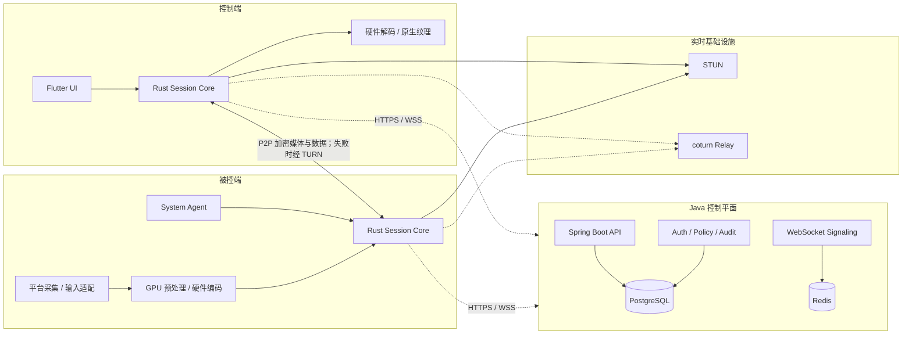

# CrossDesktopRemote

CrossDesktopRemote 是一个面向个人远程办公、临时技术支持、无人值守运维和专业图形工作的跨平台远程桌面项目。目标是在 Windows、macOS、Linux、Android、iOS/iPadOS 之间提供低延迟、高帧率、2K–4K 画质、原文件传输、多显示器、剪贴板和安全会话能力。

> 当前状态：**方案设计完成，工程代码尚未开始。** 本仓库目前包含架构、可行性、协作规则和进展记录，没有可启动的客户端或服务端。不要将下文“目标启动方式”误认为当前已经可执行。

## 项目定位

首版产品边界：

- Windows、macOS、Linux 作为完整 PC 被控端。
- Windows、macOS、Linux、Android、iPhone、iPad 作为控制端。
- Android 被控端作为需要用户授权的受限能力。
- iOS/iPadOS 首版不承诺通用系统级远程输入或无人值守。
- MVP 先保证 1080p60，随后交付 2K60；4K30/60 仅在硬件、网络和温控条件合格时开放。

## 目标功能

- 实时屏幕共享和远程键鼠/触控控制。
- 有人值守临时协助与 PC 无人值守访问。
- P2P 优先、TURN 中继兜底的网络连接。
- 低延迟、高帧率和自适应码率。
- 1080p、2K、条件化 4K 画质档位。
- 多显示器切换、平铺和独立窗口。
- 原文件传输、目录传输、校验和断点续传。
- 单向/双向文本与图片剪贴板策略。
- 设备信息、授权截图、在线状态和能力摘要。
- 会话元数据审计与显式授权的本地/加密录像。
- 设备身份、MFA、最小权限、会话票据和端到端加密。
- SaaS 辅助 P2P、局域网直连和企业私有部署。

## 总体架构



核心原则：

- Java 控制平面负责身份、设备、授权、信令、策略和审计，不处理正常会话的视频转码。
- Flutter 负责页面、状态和响应式布局，不接收或逐帧绘制 RGBA/YUV 数据。
- 视频走原生 GPU 采集、硬编、WebRTC、硬解和原生 Texture 路径。
- 屏幕、输入、文件和剪贴板优先在两端 P2P 传输；TURN 只转发加密数据。
- coturn 独立部署，不使用 Java 重写 STUN/TURN 数据面。

## 技术栈

| 层 | 技术 | 职责 |
| --- | --- | --- |
| 跨端 UI | Flutter / Dart | 桌面、手机、平板的页面、状态和响应式交互 |
| 客户端核心 | Rust | 会话、协议、权限、安全、文件、剪贴板和传输抽象 |
| 实时传输 | WebRTC | ICE、STUN/TURN、RTP、DataChannel 和拥塞控制 |
| Windows | C/C++、DXGI、Windows Graphics Capture | 采集、输入、系统服务和硬件媒体 |
| macOS/iOS | Swift、ScreenCaptureKit、VideoToolbox | Apple 平台捕获、媒体、权限和系统集成 |
| Linux | C/C++、PipeWire、XDG Portal、X11 | Wayland/X11 捕获、输入和硬件媒体 |
| Android | Kotlin、MediaProjection、MediaCodec | 移动媒体、系统授权与受限被控能力 |
| 控制平面 | Java、Spring Boot | 身份、设备、会话授权、WebSocket 信令、策略和审计 |
| 数据与状态 | PostgreSQL、Redis | 持久业务数据、在线状态、短期票据、限流和信令路由 |
| 中继 | coturn | STUN/TURN 与加密流量转发 |
| 协议 | Protobuf | 跨语言、跨版本消息定义 |

## 平台支持计划

| 平台 | 控制端 | 被控端 | 计划说明 |
| --- | --- | --- | --- |
| Windows | 完整 | 完整 | 第一个性能原型和 MVP 平台 |
| macOS | 完整 | 完整 | 依赖屏幕录制和辅助功能权限 |
| Linux X11 | 完整 | 完整 | 作为兼容与无人值守后备 |
| Linux Wayland | 完整 | 条件完整 | 依赖 XDG Portal/PipeWire 和桌面环境策略 |
| Android | 完整 | 受限 | 每次屏幕捕获需要系统授权，OEM 行为存在差异 |
| iOS/iPadOS | 完整 | 只读共享 | 首版不提供通用系统输入和无人值守 |

## 仓库结构

当前仓库只有项目文档。目标结构如下，目录将在对应阶段创建：

```text
CrossDesktopRemote/
├── apps/
│   ├── client_flutter/          # Flutter 跨端 UI
│   └── admin_web/               # 可选企业管理控制台
├── crates/
│   ├── session-core/            # Rust 会话状态机
│   ├── protocol/                # Rust 协议类型
│   ├── media-core/              # 媒体抽象与帧管线
│   ├── transfer-core/           # 文件传输
│   └── security-core/           # 设备身份与会话安全
├── platform/
│   ├── windows/
│   ├── macos/
│   ├── linux/
│   ├── android/
│   └── ios/
├── services/
│   ├── control-plane-java/      # Spring Boot 模块化单体
│   └── migrations/
├── infra/
│   ├── turn/
│   ├── observability/
│   └── deploy/
├── proto/                       # Protobuf 协议源文件
├── tests/
│   ├── interoperability/
│   ├── network-lab/
│   └── performance/
├── docs/
├── AGENT.md
├── 项目进展情况.md
├── 实现方案.md
└── 可行性分析.md
```

## 开发环境

工程脚手架建立后，预计需要：

- Flutter SDK 与各目标平台工具链。
- Rust stable toolchain、Cargo 与平台交叉编译依赖。
- 团队统一的 JDK LTS 与 Gradle Wrapper。
- Docker 与 Docker Compose，用于 PostgreSQL、Redis、coturn 和本地可观测性。
- Windows SDK/Visual Studio Build Tools、Xcode、Android Studio，以及 Linux PipeWire/Portal 开发包。

具体版本必须由脚手架和锁文件固定；README 不提前写死尚未验证的版本号。

## 当前启动方式

当前没有可运行源代码，因而没有有效的启动命令。现阶段可以审阅：

- [实现方案.md](./实现方案.md)
- [可行性分析.md](./可行性分析.md)
- [项目进展情况.md](./项目进展情况.md)
- [AGENT.md](./AGENT.md)

## 目标开发与启动方式

以下是工程脚手架需要实现的统一接口，**目前尚不可执行**：

```bash
# 启动 PostgreSQL、Redis、coturn 等本地依赖
docker compose -f infra/deploy/compose.dev.yaml up -d

# 启动 Java 控制平面
./gradlew :services:control-plane-java:bootRun

# 运行 Rust 测试
cargo test --workspace

# 启动 Flutter 桌面客户端（示例）
flutter run -d windows
flutter run -d macos
flutter run -d linux

# 启动移动客户端（示例）
flutter run -d android
flutter run -d ios
```

脚手架完成后，以上命令必须由 CI 或本地验证真实运行后才能从“目标命令”改为“正式启动命令”。

## 目标部署方式

### SaaS 辅助 P2P

- Java 控制平面、PostgreSQL、Redis 多实例部署。
- 区域化 coturn 提供 STUN/TURN。
- 媒体优先 P2P，服务器只做控制面和失败时的密文中继。

### 企业私有部署

- 使用相同 Java 服务和 coturn 组件，不维护企业专用代码分叉。
- 小规模先提供 Docker Compose，生产环境再提供 Helm/高可用拓扑。
- 企业可接入自己的 OIDC/SAML、对象存储、KMS 和日志平台。

### LAN/Direct 模式

- 同一局域网或已建立 VPN 的设备可以直接发现/连接。
- Direct 模式仍需设备证书或指纹确认，不能因省去云服务器而取消身份验证。

## 性能与安全门禁

- MVP：1080p60，局域网输入到画面响应 P95 不高于 60ms。
- 视频帧不得进入 Dart 堆或 Java 服务端。
- 文件传输完成后必须进行 SHA-256 最终校验。
- 有人值守必须显示操作者身份、权限和持续连接提示。
- 无人值守默认使用设备密钥、短期票据和 MFA，不依赖云端可逆永久密码。
- 安装包、自动更新和高权限组件必须签名。
- 未通过性能、安全和平台权限门禁前，不扩展 4K/HDR/外设映射等高阶能力。

## 项目管理与协作

- 每日计划、完成情况、阻塞和下一步记录在[项目进展情况.md](./项目进展情况.md)。
- 开发和代理协作规则见[AGENT.md](./AGENT.md)。
- 架构变更先同步修改[实现方案.md](./实现方案.md)和[可行性分析.md](./可行性分析.md)。
- Git 默认分支为 `main`；未经明确要求不自动 commit 或 push。
- commit message 使用简洁英文，并在提交前展示变更摘要。

## 当前里程碑

当前位于 **M0：立项与技术风险准备**。竞品调研、实现方案、可行性和技术栈决策已完成；下一步是建立工程脚手架并启动 Windows 端到端性能原型。
