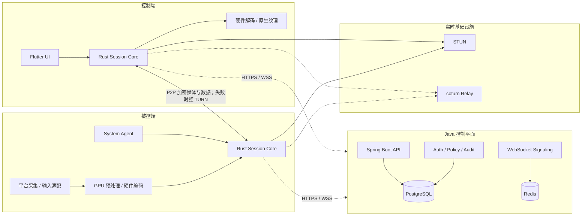

# CrossDesktopRemote

CrossDesktopRemote 是一个面向个人远程办公、临时技术支持、无人值守运维和专业图形工作的跨平台远程桌面项目。目标是在 Windows、macOS、Linux、Android、iOS/iPadOS 之间提供低延迟、高帧率、2K–4K 画质、原文件传输、多显示器、剪贴板和安全会话能力。

> 当前状态：**M0 工程基线已完成，M1 iPad→Mac 局域网原型进行中。** 基本连接、画面和远程输入已经用户验证；Apple 媒体链已具备三阶段色彩诊断、Mac GPU HDR→SDR 和 iPad BT.709 渲染。主屏与 Sidecar 在同一个 `SCStream`、RTC Track 和 Sender 上原地切换；切屏事务要求 Mac 编码器和 iPad 解码器都产生本次请求之后的新关键帧才提交，并使用不透明的事件驱动遮罩隔离旧 Texture。自动画质按区间丢包、RTT、可用带宽、掉帧和冻结次数带滞回升降档，目标尺寸直接下发到 ScreenCaptureKit。全屏系统键盘覆盖在稳定视频画布上，另提供可拖动的快捷小键盘。Flutter `analyze`、63 个测试及 macOS/iOS Debug 构建通过；关键帧事务、自动画质、实际清晰度、色彩、连续切屏和延迟仍需物理双设备复验。

## 项目定位

首版产品边界：

- Windows、macOS、Linux 作为完整 PC 被控端。
- Windows、macOS、Linux、Android、iPhone、iPad 作为控制端。
- Android 被控端作为需要用户授权的受限能力。
- iOS/iPadOS 首版不承诺通用系统级远程输入或无人值守。
- MVP 先保证 1080p60，随后交付 2K60；4K30/60 仅在硬件、网络和温控条件合格时开放。

## 目标功能

- 实时屏幕共享和远程键鼠/触控控制。
- 有人值守临时协助与 PC 无人值守访问。
- P2P 优先、TURN 中继兜底的网络连接。
- 低延迟、高帧率和自适应码率。
- 1080p、2K、条件化 4K 画质档位。
- 多显示器切换、平铺和独立窗口。
- 原文件传输、目录传输、校验和断点续传。
- 单向/双向文本与图片剪贴板策略。
- 设备信息、授权截图、在线状态和能力摘要。
- 会话元数据审计与显式授权的本地/加密录像。
- 设备身份、MFA、最小权限、会话票据和端到端加密。
- SaaS 辅助 P2P、局域网直连和企业私有部署。

## 总体架构



核心原则：

- Java 控制平面负责身份、设备、授权、信令、策略和审计，不处理正常会话的视频转码。
- Flutter 负责页面、状态和响应式布局，不接收或逐帧绘制 RGBA/YUV 数据。
- M1 Apple 原型由项目内维护的 `flutter_webrtc 1.6.0` fork 在原生层完成媒体与视频视图，Dart 只管理会话和小型控制消息；fork 明确约束 macOS SDR/Rec.709/Video-Range 采集，阶段结束后再根据性能数据决定继续维护或迁移到自有媒体适配器。
- 视频走原生 GPU 采集、硬编、WebRTC、硬解和原生 Texture 路径。
- 屏幕、输入、文件和剪贴板优先在两端 P2P 传输；TURN 只转发加密数据。
- coturn 独立部署，不使用 Java 重写 STUN/TURN 数据面。

## 技术栈

| 层 | 技术 | 职责 |
| --- | --- | --- |
| 跨端 UI | Flutter / Dart | 桌面、手机、平板的页面、状态和响应式交互 |
| 客户端核心 | Rust | 会话、协议、权限、安全、文件、剪贴板和传输抽象 |
| 实时传输 | WebRTC；原型使用 `flutter_webrtc` 1.6.x | ICE、STUN/TURN、RTP、DataChannel、Apple 原生渲染和拥塞控制 |
| Windows | C/C++、DXGI、Windows Graphics Capture | 采集、输入、系统服务和硬件媒体 |
| macOS/iOS | Swift、ScreenCaptureKit、VideoToolbox | Apple 平台捕获、媒体、权限和系统集成 |
| Linux | C/C++、PipeWire、XDG Portal、X11 | Wayland/X11 捕获、输入和硬件媒体 |
| Android | Kotlin、MediaProjection、MediaCodec | 移动媒体、系统授权与受限被控能力 |
| 控制平面 | Java、Spring Boot | 身份、设备、会话授权、WebSocket 信令、策略和审计 |
| 数据与状态 | PostgreSQL、Redis | 持久业务数据、在线状态、短期票据、限流和信令路由 |
| 中继 | coturn | STUN/TURN 与加密流量转发 |
| 协议 | Protobuf | 跨语言、跨版本消息定义 |

## 平台支持计划

| 平台 | 控制端 | 被控端 | 计划说明 |
| --- | --- | --- | --- |
| Windows | 完整 | 完整 | 第一个性能原型和 MVP 平台 |
| macOS | 完整 | 完整 | 依赖屏幕录制和辅助功能权限 |
| Linux X11 | 完整 | 完整 | 作为兼容与无人值守后备 |
| Linux Wayland | 完整 | 条件完整 | 依赖 XDG Portal/PipeWire 和桌面环境策略 |
| Android | 完整 | 受限 | 每次屏幕捕获需要系统授权，OEM 行为存在差异 |
| iOS/iPadOS | 完整 | 只读共享 | 首版不提供通用系统输入和无人值守 |

## 仓库结构

当前目录边界、三类主要工程、协议生成、本地基础设施和统一验收入口已经建立；Apple 纵向原型已进入双设备人工验收，其他平台媒体适配仍未实现：

```text
CrossDesktopRemote/
├── apps/
│   ├── client_flutter/          # Flutter 跨端 UI
│   └── admin_web/               # 可选企业管理控制台
├── crates/
│   ├── session-core/            # Rust 会话状态机
│   ├── protocol/                # Rust 协议类型
│   ├── media-core/              # 媒体抽象与帧管线
│   ├── transfer-core/           # 文件传输
│   ├── security-core/           # 设备身份与会话安全
│   └── client-ffi/              # 面向 Flutter/原生壳的窄 C ABI
├── platform/
│   ├── windows/
│   ├── macos/
│   ├── linux/
│   ├── android/
│   └── ios/
├── services/
│   ├── control-plane-java/      # Spring Boot 模块化单体
│   └── migrations/
├── infra/
│   ├── turn/
│   ├── observability/
│   └── deploy/
├── proto/                       # Protobuf 协议源文件
├── tests/
│   ├── interoperability/
│   ├── network-lab/
│   └── performance/
├── docs/
├── scripts/                     # 工具链检查与官方生成器入口
├── AGENT.md
├── 项目进展情况.md
├── 实现方案.md
└── 可行性分析.md
```

## 开发环境

当前已验证：

- Flutter 3.47.0 stable、Dart 3.13.0；Rust/Cargo 1.97.1。
- Protobuf Compiler 35.1、Buf 1.72.0、`protoc-gen-dart` 25.0.0。
- OpenJDK 17、Docker 28.0.1、Compose 2.33.1、CMake 4.2.0。
- Android SDK 36.0.0、Xcode 26.6、CocoaPods 1.17.0；`flutter doctor` 已认可 Android 和 Apple 工具链。
- Android NDK 28.2.13676358、`cargo-ndk` 4.1.2 及三个 Android Rust target。
- Spring 工程使用官方生成的 Gradle 9.5.1 Wrapper。

完整跨平台开发仍需要：

- Flutter 各目标平台工具链。
- Rust 平台交叉编译依赖。
- 团队统一的 JDK LTS 与 Gradle Wrapper。
- Docker 与 Docker Compose，用于 PostgreSQL、Redis、coturn 和本地可观测性。
- Windows SDK/Visual Studio Build Tools、Xcode、Android Studio，以及 Linux PipeWire/Portal 开发包。

工具的绝对路径和环境变量用法见[工程搭建说明](./docs/工程搭建.md)。当前登录 Shell 未继承 Flutter/Rust 的用户 PATH 时，统一脚本仍可通过 `CROSSDESKTOP_FLUTTER_BIN` 和 `CROSSDESKTOP_ANDROID_NDK_HOME` 显式定位工具。

## 本地启动与验收

启动 PostgreSQL、Redis 和 coturn：

```bash
./scripts/dev-up.sh

# 查看状态
docker compose -f infra/deploy/compose.dev.yaml ps
```

启动 Java 控制平面：

```bash
SPRING_PROFILES_ACTIVE=local \
  ./services/control-plane-java/gradlew \
  -p services/control-plane-java \
  bootRun

# 服务启动后
curl http://localhost:8080/actuator/health
```

运行 iPad→Mac 局域网原型：

```bash
# 终端 1：保持 Java 信令服务运行
SPRING_PROFILES_ACTIVE=local \
  ./services/control-plane-java/gradlew \
  -p services/control-plane-java \
  bootRun

# 终端 2：启动 Flutter 客户端；Mac 可选择“共享本机”或“控制其他设备”
cd apps/client_flutter
flutter run -d macos

# iPad 控制端（替换为 flutter devices 显示的设备 ID）
flutter run -d <ipad-device-id>
```

Mac 选择“共享本机”，先点击“设置远程输入权限”，然后点击“开始共享本机”；iPad 的“附近设备”会通过 Bonjour 自动显示被控端，点击后只需输入相同六位连接码。未过期的正确连接码验证成功后自动建立会话，不再需要被控端二次允许。一段远程会话结束后，Mac 保持共享意图，自动生成新的单次连接码并恢复等待；只有点击“停止共享本机”才会退出共享状态。如果网络禁止 mDNS，仍可从“控制端可用连接地址”列表选择对应 Wi-Fi/有线地址手动输入。macOS 的屏幕录制和事件注入权限必须由本机用户在系统设置中授予；未授权时会话降级为仅观看。当前连接码信令只用于开发环境，不可暴露到公网。

### iPad 远程输入

- 直接触控：轻点左键、双击、按住拖选、双击第二下拖选、双指轻点右键、双指滚动；静止长按是备用右键。
- 触控板：单指移动/轻点、双指右键/滚动、双击第二下按住拖动；右下角提供左键、右键和拖拽锁定按钮。
- 工具栏“更多”菜单提供两种模式的操作说明、指针/滚动灵敏度和输入延迟诊断。
- iOS 远程键盘使用隐藏的原生 `UITextView` 输入代理：组合文本留在 UIKit，最终文本和退格作为独立可靠事件发送；默认界面不保存远端文本历史。
- 键盘可选择“系统完整键盘”或“快捷小键盘”，选择会持久化。系统键盘负责文字、拼音、符号和表情；可拖动的小键盘负责 Esc、Tab、Enter、方向键、修饰键及复制/粘贴等常用组合键，不自行实现输入法。
- iPad 全屏打开系统键盘时远程画布不缩放；停靠键盘通过安全 Insets 定位控制栏，浮动键盘由原生 `UIKeyboardLayoutGuide` 上报几何，控制栏移动到顶部避免相互遮挡。
- Apple 简体拼音从拉丁拼音转换为完整 CJK 候选时触发即时提交；“本地编辑后发送”作为第三方输入法和特殊应用的兼容入口，其控制器生命周期由独立页面管理。
- Debug 版键盘栏提供隐私安全的 IME 诊断，只显示事件类型、长度和 CJK 标记，不记录实际输入内容。
- Debug 版本可从“输入设置与诊断”发送固定中文诊断文本“你好”，用于区分 iPad IME 和 Mac Unicode 注入问题。

物理设备验收步骤见 [iPad 控制 Mac 输入验收](./docs/iPad控制Mac输入验收.md)。

### 显示调整与色彩诊断

- 全局 Message 使用安全区下方、屏幕高度约 17% 的 Overlay，不再占据底部操作区域。
- 远程工具栏“显示调整与色彩诊断”提供自动、标准 SDR、柔和高光和自定义亮度/对比度/饱和度；设置按远程设备和显示器独立保存。
- 色彩诊断分别显示 ScreenCaptureKit 原始帧、WebRTC 编码器输入、iPad 解码输出和 Texture 输入的像素格式、Range、色彩附件、Y 值范围与 16 桶灰阶直方图；只传输统计，不传输屏幕像素。
- 多显示器切换使用带序号的双端提交事务：macOS 13+ 在同一个 `SCStream` 上调用 `updateConfiguration()` 和 `updateContentFilter()`，并保持 RTC Track、Sender、MID、SSRC 和 DataChannel 不变；Mac 先确认目标 ScreenCaptureKit 首帧及本次请求后的 `keyFramesEncoded` 增长，iPad 再确认 `keyFramesDecoded` 增长，之后才更新名称和输入目标。关键帧请求最多重试一次，统计不支持时安全中止而不误提交旧帧；旧系统才使用 `replaceTrack()` 兼容路径。
- ScreenCaptureKit 切屏更新期间暂停转发；更新完成后只接收状态为 `.complete`、尺寸匹配且连续稳定的目标帧，并在新 NV12 画布上先填充 Video-Range 黑色再渲染。iPad 在 120ms 内保留原画面，超过 120ms 才用不透明遮罩隔离旧 Texture，超过 800ms 显示等待状态，目标解码帧到达后立即以 120ms 淡出，不使用固定等待时间。遮罩不直接定时清空 Texture，避免误删已提前解码的目标静态帧。
- 显示器协议分别携带逻辑尺寸、采集像素尺寸和点像素比例：远程输入继续使用逻辑坐标，视频画质与 WebRTC 适配使用实际像素。macOS 14+ 通过 `SCContentFilter.contentRect × pointPixelScale` 采集，旧系统回退到 `CGDisplayPixelsWide/High`，避免把 Sidecar 的逻辑尺寸放大成模糊视频。
- 自动画质默认从 1080p30/7 Mbps 开始，以 1 秒区间统计观察丢包、RTT、可用出站带宽、编码耗时、掉帧、冻结和拥塞原因；连续 2 个坏样本降档，连续 10 个好样本且至少稳定 15 秒才升档。档位依次为 1080p60、1080p30、720p60、720p30，切换失败会回滚；手动画质不被自动策略覆盖。
- 画质目标先通过项目内插件更新 ScreenCaptureKit 的采集尺寸和帧率，再更新 RTP Sender 的码率/帧率；不支持原生更新的平台才使用 Sender 缩放。macOS 优先使用 VideoToolbox H.264，减少软件编码引起的卡顿。
- 会话诊断展示区间码率/丢包、带宽、掉帧/冻结、关键帧、NACK/PLI/FIR、codec 和编解码器实现；色彩诊断同时记录 SCK `contentRect`、scale 与 PixelBuffer 尺寸，用于区分源画面残留、编码参考帧污染和接收端渲染问题。
- iPad 全屏采用“工具栏 + 稳定视频画布”的结构；软键盘和快捷小键盘覆盖在画布上，不再改变视频尺寸与指针变换。视频显示与指针归一化复用同一个变换，输入只绑定已经真实渲染的显示器；Mac 绝对坐标限制在最后一个有效逻辑像素，避免视觉偏移、串屏和边缘越界。
- Java 信令对失败连接采用两级限流：同一来源与连接码 5 次/分钟，来源跨连接码 20 次/分钟。旧码达到邀请级限流后可改用新的正确连接码，轮换随机码仍会触发来源级保护；关闭原因携带作用域和剩余等待秒数。
- WebRTC 的瞬时 `Disconnected` 先进入 8 秒恢复窗口，不关闭 DataChannel、WebSocket 或更换连接码；只有恢复超时、`Failed`、`hangup` 或 `peer-left` 才按终止会话处理。
- macOS 采集使用仓库内 `third_party/flutter_webrtc` fork：macOS 15+ 显式请求 SDR；每帧经 Core Image/Metal 执行自动 HDR→SDR 色调映射和 Rec.709 `420v` 归一化，不再用覆盖附件代替像素转换。
- iPad 优先用 Core Image 按解码 PixelBuffer 的真实格式、Range 和附件转换为 sRGB BGRA；解码器只返回 I420 时，使用 Accelerate/vImage 的 BT.709 Video-Range 矩阵，不再使用缺少色彩参数的默认 I420→ARGB 路径。
- 工具栏可要求 Mac 显示 SDR 灰阶测试图和打开显示器设置，用于 HDR 开关 A/B；关闭 HDR 不是正式解决方案。

物理色彩验收步骤见 [iPad 控制 Mac 色彩验收](./docs/iPad控制Mac色彩验收.md)。

### 会话与设置

- “会话”展示当前角色、设备、显示器、画质、发送/接收分辨率、输入 RTT 和持续时间，并支持复制隐私安全的诊断摘要和主动断开。
- 正常结束或失败的流式会话会在本机记录开始/结束时间、角色、设备、显示器、画质和结果；不记录屏幕、剪贴板或键盘内容，默认最多保留 50 条，可在确认后清空。
- “设置”可持久化默认画质、触控模式、指针/滚动灵敏度、局域网发现、历史记录策略和高级网络信息显示；简单选项使用 `SharedPreferencesAsync`，平台插件不可用的测试/预览环境会安全退化。
- 设备页默认只展示连接码、推荐地址、状态、权限和主操作；回环信令地址、全部网卡和 Java 控制平面提示移入“显示高级网络信息”。

执行完整 M0 基线验收：

```bash
CROSSDESKTOP_FLUTTER_BIN=/Volumes/zhiti-1T/Library/flutter/bin \
CROSSDESKTOP_ANDROID_NDK_HOME=/Volumes/zhiti-1T/Library/android-sdk/ndk/28.2.13676358 \
  ./scripts/check-all.sh
```

也可以分别执行：

```bash
./scripts/generate-proto.sh

cargo fmt --all -- --check
cargo clippy --workspace --all-targets -- -D warnings
cargo test --workspace

cd apps/client_flutter
flutter analyze
flutter test
flutter build macos --debug
flutter build apk --debug
flutter build ios --simulator --debug

./services/control-plane-java/gradlew \
  -p services/control-plane-java \
  test
```

当前验收结果：

| 模块 | 已通过 | 未通过或未完成 |
| --- | --- | --- |
| Flutter | 响应式壳层、真实会话/设置页面、会话元数据历史、Apple Bonjour、共享恢复、瞬时断线宽限、单 `SCStream` 关键帧双端提交切屏、事件驱动遮罩、稳定全屏画布、系统/快捷双键盘、色彩/HDR/SCK 几何诊断、Sidecar/Retina 实际像素采集、带滞回自动画质、区间媒体统计、手势和 iOS 原生 IME；`analyze`、63 个测试、6 个 Swift 测试及 macOS/iOS Debug build | 强制关键帧计数、自动升降档、SDR 灰阶、HDR A/B、Sidecar 实际清晰度/居中、30 次连续切屏、两种键盘、IME 候选/退格、触控手感和 P95 延迟需物理双设备复验；Windows、Linux 尚未构建 |
| Rust | `fmt`、Clippy、6 个 workspace test；macOS 动态库与 Android 三 ABI | 媒体、传输和安全 crate 仍是占位；平台发布打包待接入 |
| Java | PostgreSQL/Redis、Flyway V1、健康检查；连接码 5 分钟 TTL、单次消费、邀请/来源两级限流、`retryAfter` 和 9 个测试 | 身份、设备注册、Redis 分布式限流、生产会话票据和 WSS 尚未实现 |
| Protobuf | v1 基础消息、Buf lint、Java/Rust/Dart 生成和编译 | 业务协议需要随 M1/M2 增量完善并做兼容测试 |
| Infrastructure | PostgreSQL、Redis、coturn Compose 均健康 | 当前仅本地开发配置；生产密钥、TLS、高可用尚未配置 |

相关说明：

- [实现方案.md](./实现方案.md)
- [可行性分析.md](./可行性分析.md)
- [项目进展情况.md](./项目进展情况.md)
- [AGENT.md](./AGENT.md)
- [工程搭建说明](./docs/工程搭建.md)
- [局域网发现与跨平台适配](./docs/局域网发现与跨平台适配.md)

## 工程复现方式

三类框架工程已经通过对应生成命令创建；以下脚本保留用于新环境复现，不会覆盖已存在工程：

```bash
./scripts/bootstrap-spring.sh
./scripts/bootstrap-flutter.sh  # 已安装；新终端需先配置 PATH
./scripts/bootstrap-rust.sh     # 已安装；新终端需先配置 PATH
```

这些脚本用于新环境复现，不覆盖已存在工程。协议生成、本地依赖和统一验收应分别使用 `generate-proto.sh`、`dev-up.sh` 和 `check-all.sh`。

## 目标部署方式

### SaaS 辅助 P2P

- Java 控制平面、PostgreSQL、Redis 多实例部署。
- 区域化 coturn 提供 STUN/TURN。
- 媒体优先 P2P，服务器只做控制面和失败时的密文中继。

### 企业私有部署

- 使用相同 Java 服务和 coturn 组件，不维护企业专用代码分叉。
- 小规模先提供 Docker Compose，生产环境再提供 Helm/高可用拓扑。
- 企业可接入自己的 OIDC/SAML、对象存储、KMS 和日志平台。

### LAN/Direct 模式

- 同一局域网或已建立 VPN 的设备可以直接发现/连接。
- Direct 模式仍需设备证书或指纹确认，不能因省去云服务器而取消身份验证。

## 性能与安全门禁

- MVP：1080p60，局域网输入到画面响应 P95 不高于 60ms。
- 视频帧不得进入 Dart 堆或 Java 服务端。
- 文件传输完成后必须进行 SHA-256 最终校验。
- 有人值守必须显示操作者身份、权限和持续连接提示。
- 无人值守默认使用设备密钥、短期票据和 MFA，不依赖云端可逆永久密码。
- 安装包、自动更新和高权限组件必须签名。
- 未通过性能、安全和平台权限门禁前，不扩展 4K/HDR/外设映射等高阶能力。

## 项目管理与协作

- 每日计划、完成情况、阻塞和下一步记录在[项目进展情况.md](./项目进展情况.md)。
- 开发和代理协作规则见[AGENT.md](./AGENT.md)。
- 架构变更先同步修改[实现方案.md](./实现方案.md)和[可行性分析.md](./可行性分析.md)。
- Git 默认分支为 `main`；未经明确要求不自动 commit 或 push。
- commit message 使用简洁英文，并在提交前展示变更摘要。

## 当前里程碑

当前位于 **M1：iPad 控制 Mac 局域网纵向原型**。下一门禁是物理 iPad 与 Mac 完成 30 次主屏/Sidecar 往返切换，确认每次编码/解码关键帧计数递增且无横向残影；随后用稳定局域网和受控弱网验证自动档升降级、1080p30/60 P95、30 分钟资源稳定和断线恢复。通过后再推进 TURN 和 Windows GPU 性能原型。
