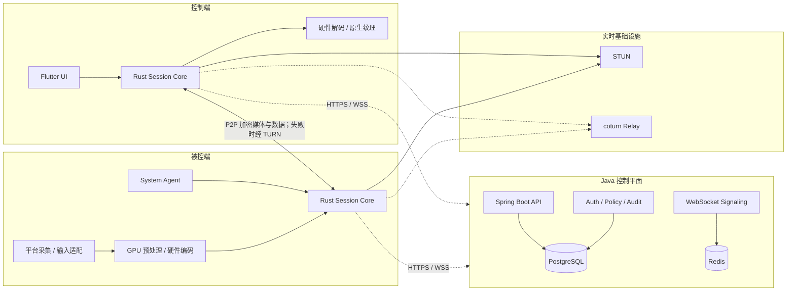

# CrossDesktopRemote

CrossDesktopRemote 是一个面向个人远程办公、临时技术支持、无人值守运维和专业图形工作的跨平台远程桌面项目。目标是在 Windows、macOS、Linux、Android、iOS/iPadOS 之间提供低延迟、高帧率、2K–4K 画质、原文件传输、多显示器、剪贴板和安全会话能力。

> 当前状态：**M0 工程基线已完成，M1 iPad→Mac 局域网原型进行中。** 已建立五分钟有效、单次消费并按来源限流的开发态连接码，验证成功后被控端自动建立 WebRTC；客户端已支持 Mac 控制/共享角色切换、应用级消息反馈、触控板/直接触控、可见软键盘、适应/填满/沉浸全屏、720p/1080p/2K/原画档位和单路多显示器切换。macOS 和 iOS 真机目标构建通过；系统权限与真实输入仍需物理双设备人工验收。

## 项目定位

首版产品边界：

- Windows、macOS、Linux 作为完整 PC 被控端。
- Windows、macOS、Linux、Android、iPhone、iPad 作为控制端。
- Android 被控端作为需要用户授权的受限能力。
- iOS/iPadOS 首版不承诺通用系统级远程输入或无人值守。
- MVP 先保证 1080p60，随后交付 2K60；4K30/60 仅在硬件、网络和温控条件合格时开放。

## 目标功能

- 实时屏幕共享和远程键鼠/触控控制。
- 有人值守临时协助与 PC 无人值守访问。
- P2P 优先、TURN 中继兜底的网络连接。
- 低延迟、高帧率和自适应码率。
- 1080p、2K、条件化 4K 画质档位。
- 多显示器切换、平铺和独立窗口。
- 原文件传输、目录传输、校验和断点续传。
- 单向/双向文本与图片剪贴板策略。
- 设备信息、授权截图、在线状态和能力摘要。
- 会话元数据审计与显式授权的本地/加密录像。
- 设备身份、MFA、最小权限、会话票据和端到端加密。
- SaaS 辅助 P2P、局域网直连和企业私有部署。

## 总体架构



核心原则：

- Java 控制平面负责身份、设备、授权、信令、策略和审计，不处理正常会话的视频转码。
- Flutter 负责页面、状态和响应式布局，不接收或逐帧绘制 RGBA/YUV 数据。
- M1 Apple 原型由 `flutter_webrtc` 在原生层完成媒体与视频视图，Dart 只管理会话和小型控制消息；阶段结束后再根据性能数据决定是否替换插件路径。
- 视频走原生 GPU 采集、硬编、WebRTC、硬解和原生 Texture 路径。
- 屏幕、输入、文件和剪贴板优先在两端 P2P 传输；TURN 只转发加密数据。
- coturn 独立部署，不使用 Java 重写 STUN/TURN 数据面。

## 技术栈

| 层 | 技术 | 职责 |
| --- | --- | --- |
| 跨端 UI | Flutter / Dart | 桌面、手机、平板的页面、状态和响应式交互 |
| 客户端核心 | Rust | 会话、协议、权限、安全、文件、剪贴板和传输抽象 |
| 实时传输 | WebRTC；原型使用 `flutter_webrtc` 1.6.x | ICE、STUN/TURN、RTP、DataChannel、Apple 原生渲染和拥塞控制 |
| Windows | C/C++、DXGI、Windows Graphics Capture | 采集、输入、系统服务和硬件媒体 |
| macOS/iOS | Swift、ScreenCaptureKit、VideoToolbox | Apple 平台捕获、媒体、权限和系统集成 |
| Linux | C/C++、PipeWire、XDG Portal、X11 | Wayland/X11 捕获、输入和硬件媒体 |
| Android | Kotlin、MediaProjection、MediaCodec | 移动媒体、系统授权与受限被控能力 |
| 控制平面 | Java、Spring Boot | 身份、设备、会话授权、WebSocket 信令、策略和审计 |
| 数据与状态 | PostgreSQL、Redis | 持久业务数据、在线状态、短期票据、限流和信令路由 |
| 中继 | coturn | STUN/TURN 与加密流量转发 |
| 协议 | Protobuf | 跨语言、跨版本消息定义 |

## 平台支持计划

| 平台 | 控制端 | 被控端 | 计划说明 |
| --- | --- | --- | --- |
| Windows | 完整 | 完整 | 第一个性能原型和 MVP 平台 |
| macOS | 完整 | 完整 | 依赖屏幕录制和辅助功能权限 |
| Linux X11 | 完整 | 完整 | 作为兼容与无人值守后备 |
| Linux Wayland | 完整 | 条件完整 | 依赖 XDG Portal/PipeWire 和桌面环境策略 |
| Android | 完整 | 受限 | 每次屏幕捕获需要系统授权，OEM 行为存在差异 |
| iOS/iPadOS | 完整 | 只读共享 | 首版不提供通用系统输入和无人值守 |

## 仓库结构

当前目录边界、三类主要工程、协议生成、本地基础设施和统一验收入口已经建立；Apple 纵向原型已进入双设备人工验收，其他平台媒体适配仍未实现：

```text
CrossDesktopRemote/
├── apps/
│   ├── client_flutter/          # Flutter 跨端 UI
│   └── admin_web/               # 可选企业管理控制台
├── crates/
│   ├── session-core/            # Rust 会话状态机
│   ├── protocol/                # Rust 协议类型
│   ├── media-core/              # 媒体抽象与帧管线
│   ├── transfer-core/           # 文件传输
│   ├── security-core/           # 设备身份与会话安全
│   └── client-ffi/              # 面向 Flutter/原生壳的窄 C ABI
├── platform/
│   ├── windows/
│   ├── macos/
│   ├── linux/
│   ├── android/
│   └── ios/
├── services/
│   ├── control-plane-java/      # Spring Boot 模块化单体
│   └── migrations/
├── infra/
│   ├── turn/
│   ├── observability/
│   └── deploy/
├── proto/                       # Protobuf 协议源文件
├── tests/
│   ├── interoperability/
│   ├── network-lab/
│   └── performance/
├── docs/
├── scripts/                     # 工具链检查与官方生成器入口
├── AGENT.md
├── 项目进展情况.md
├── 实现方案.md
└── 可行性分析.md
```

## 开发环境

当前已验证：

- Flutter 3.47.0 stable、Dart 3.13.0；Rust/Cargo 1.97.1。
- Protobuf Compiler 35.1、Buf 1.72.0、`protoc-gen-dart` 25.0.0。
- OpenJDK 17、Docker 28.0.1、Compose 2.33.1、CMake 4.2.0。
- Android SDK 36.0.0、Xcode 26.6、CocoaPods 1.17.0；`flutter doctor` 已认可 Android 和 Apple 工具链。
- Android NDK 28.2.13676358、`cargo-ndk` 4.1.2 及三个 Android Rust target。
- Spring 工程使用官方生成的 Gradle 9.5.1 Wrapper。

完整跨平台开发仍需要：

- Flutter 各目标平台工具链。
- Rust 平台交叉编译依赖。
- 团队统一的 JDK LTS 与 Gradle Wrapper。
- Docker 与 Docker Compose，用于 PostgreSQL、Redis、coturn 和本地可观测性。
- Windows SDK/Visual Studio Build Tools、Xcode、Android Studio，以及 Linux PipeWire/Portal 开发包。

工具的绝对路径和环境变量用法见[工程搭建说明](./docs/工程搭建.md)。当前登录 Shell 未继承 Flutter/Rust 的用户 PATH 时，统一脚本仍可通过 `CROSSDESKTOP_FLUTTER_BIN` 和 `CROSSDESKTOP_ANDROID_NDK_HOME` 显式定位工具。

## 本地启动与验收

启动 PostgreSQL、Redis 和 coturn：

```bash
./scripts/dev-up.sh

# 查看状态
docker compose -f infra/deploy/compose.dev.yaml ps
```

启动 Java 控制平面：

```bash
SPRING_PROFILES_ACTIVE=local \
  ./services/control-plane-java/gradlew \
  -p services/control-plane-java \
  bootRun

# 服务启动后
curl http://localhost:8080/actuator/health
```

运行 iPad→Mac 局域网原型：

```bash
# 终端 1：保持 Java 信令服务运行
SPRING_PROFILES_ACTIVE=local \
  ./services/control-plane-java/gradlew \
  -p services/control-plane-java \
  bootRun

# 终端 2：启动 Flutter 客户端；Mac 可选择“共享本机”或“控制其他设备”
cd apps/client_flutter
flutter run -d macos

# iPad 控制端（替换为 flutter devices 显示的设备 ID）
flutter run -d <ipad-device-id>
```

Mac 选择“共享本机”，先点击“设置远程输入权限”，然后点击“开始共享本机”；iPad 的“附近设备”会通过 Bonjour 自动显示被控端，点击后只需输入相同六位连接码。未过期的正确连接码验证成功后自动建立会话，不再需要被控端二次允许。如果网络禁止 mDNS，仍可从“控制端可用连接地址”列表选择对应 Wi-Fi/有线地址手动输入。macOS 的屏幕录制和事件注入权限必须由本机用户在系统设置中授予；未授权时会话降级为仅观看。当前连接码信令只用于开发环境，不可暴露到公网。

执行完整 M0 基线验收：

```bash
CROSSDESKTOP_FLUTTER_BIN=/Volumes/zhiti-1T/Library/flutter/bin \
CROSSDESKTOP_ANDROID_NDK_HOME=/Volumes/zhiti-1T/Library/android-sdk/ndk/28.2.13676358 \
  ./scripts/check-all.sh
```

也可以分别执行：

```bash
./scripts/generate-proto.sh

cargo fmt --all -- --check
cargo clippy --workspace --all-targets -- -D warnings
cargo test --workspace

cd apps/client_flutter
flutter analyze
flutter test
flutter build macos --debug
flutter build apk --debug
flutter build ios --simulator --debug

./services/control-plane-java/gradlew \
  -p services/control-plane-java \
  test
```

当前验收结果：

| 模块 | 已通过 | 未通过或未完成 |
| --- | --- | --- |
| Flutter | 响应式壳层、持久会话、Apple Bonjour、角色切换、全局消息、动态画面/全屏、触控与可见键盘、清晰度档位和单路多屏切换；`analyze`、16 个常规测试、macOS/iOS 真机目标 build | 系统权限、真实输入和多屏需物理双设备复验；Windows、Linux 尚未构建 |
| Rust | `fmt`、Clippy、6 个 workspace test；macOS 动态库与 Android 三 ABI | 媒体、传输和安全 crate 仍是占位；平台发布打包待接入 |
| Java | PostgreSQL/Redis、Flyway V1、健康检查；连接码 5 分钟 TTL、单次消费、每来源限流和 8 个测试 | 身份、设备注册、Redis 分布式限流、生产会话票据和 WSS 尚未实现 |
| Protobuf | v1 基础消息、Buf lint、Java/Rust/Dart 生成和编译 | 业务协议需要随 M1/M2 增量完善并做兼容测试 |
| Infrastructure | PostgreSQL、Redis、coturn Compose 均健康 | 当前仅本地开发配置；生产密钥、TLS、高可用尚未配置 |

相关说明：

- [实现方案.md](./实现方案.md)
- [可行性分析.md](./可行性分析.md)
- [项目进展情况.md](./项目进展情况.md)
- [AGENT.md](./AGENT.md)
- [工程搭建说明](./docs/工程搭建.md)
- [局域网发现与跨平台适配](./docs/局域网发现与跨平台适配.md)

## 工程复现方式

三类框架工程已经通过对应生成命令创建；以下脚本保留用于新环境复现，不会覆盖已存在工程：

```bash
./scripts/bootstrap-spring.sh
./scripts/bootstrap-flutter.sh  # 已安装；新终端需先配置 PATH
./scripts/bootstrap-rust.sh     # 已安装；新终端需先配置 PATH
```

这些脚本用于新环境复现，不覆盖已存在工程。协议生成、本地依赖和统一验收应分别使用 `generate-proto.sh`、`dev-up.sh` 和 `check-all.sh`。

## 目标部署方式

### SaaS 辅助 P2P

- Java 控制平面、PostgreSQL、Redis 多实例部署。
- 区域化 coturn 提供 STUN/TURN。
- 媒体优先 P2P，服务器只做控制面和失败时的密文中继。

### 企业私有部署

- 使用相同 Java 服务和 coturn 组件，不维护企业专用代码分叉。
- 小规模先提供 Docker Compose，生产环境再提供 Helm/高可用拓扑。
- 企业可接入自己的 OIDC/SAML、对象存储、KMS 和日志平台。

### LAN/Direct 模式

- 同一局域网或已建立 VPN 的设备可以直接发现/连接。
- Direct 模式仍需设备证书或指纹确认，不能因省去云服务器而取消身份验证。

## 性能与安全门禁

- MVP：1080p60，局域网输入到画面响应 P95 不高于 60ms。
- 视频帧不得进入 Dart 堆或 Java 服务端。
- 文件传输完成后必须进行 SHA-256 最终校验。
- 有人值守必须显示操作者身份、权限和持续连接提示。
- 无人值守默认使用设备密钥、短期票据和 MFA，不依赖云端可逆永久密码。
- 安装包、自动更新和高权限组件必须签名。
- 未通过性能、安全和平台权限门禁前，不扩展 4K/HDR/外设映射等高阶能力。

## 项目管理与协作

- 每日计划、完成情况、阻塞和下一步记录在[项目进展情况.md](./项目进展情况.md)。
- 开发和代理协作规则见[AGENT.md](./AGENT.md)。
- 架构变更先同步修改[实现方案.md](./实现方案.md)和[可行性分析.md](./可行性分析.md)。
- Git 默认分支为 `main`；未经明确要求不自动 commit 或 push。
- commit message 使用简洁英文，并在提交前展示变更摘要。

## 当前里程碑

当前位于 **M1：iPad 控制 Mac 局域网纵向原型**。选择 Apple 设备组合是为了让单人开发先完成第一个真实远控闭环。下一门禁是物理 iPad 与 Mac 在同一局域网完成 720p30 画面、点击/拖动/滚动、10 分钟资源稳定和断线释放；通过后再优化 1080p60、TURN 和 30 分钟稳定性，随后进入 Windows GPU 性能原型。
