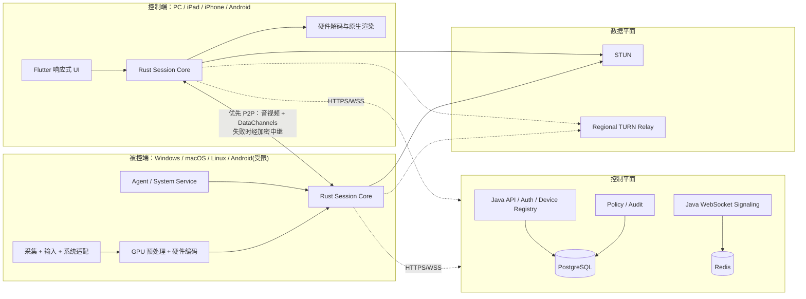
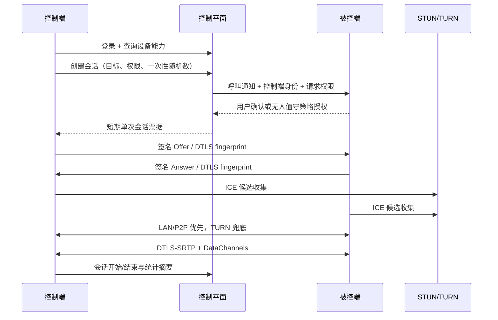

# CrossDesktopRemote 实现方案

> 文档版本：0.2
> 调研与设计基准日：2026-08-17
> 状态：技术栈决策稿；Flutter UI 与 Java 服务端已冻结，媒体性能基线仍需第 0 阶段原型验证

## 1. 结论与产品定位

CrossDesktopRemote 应定位为“面向个人远程办公、技术支持和专业图形工作的高性能跨平台远程桌面”，首版采用 **PC 作为完整被控端，PC、iPad/iPhone、Android 手机/平板作为控制端** 的策略。Android 被控作为受限增强功能，iOS/iPadOS 被控首版只提供用户主动发起的屏幕共享，不承诺通用远程输入控制或真正无人值守。

推荐技术基线如下：

- UI：Flutter，复用设备列表、设置、文件中心、会话工具栏等业务界面，并为桌面、平板、手机分别做响应式布局；不采用 Electron。
- 客户端核心：Rust，承载会话状态机、权限、协议消息、文件传输、剪贴板、遥测及安全逻辑。
- 平台媒体适配：Windows 使用 DXGI/Windows Graphics Capture，macOS 使用 ScreenCaptureKit，Linux 使用 PipeWire/XDG Portal 与 X11 后备；编码和渲染走平台硬件 API。
- 实时传输：首版使用原生 WebRTC 的 ICE + STUN/TURN、RTP 与 DataChannel；在接口层隔离传输实现，为后续自研 QUIC/UDP 媒体传输预留替换能力。
- 服务端：Java + Spring Boot 模块化单体负责账号、设备、信令、策略和审计；PostgreSQL + Redis；STUN/TURN 使用独立 coturn 节点并按区域扩展。
- 安全：设备身份密钥、短期单次会话令牌、签名绑定 DTLS 指纹、WebRTC DTLS-SRTP、细粒度会话授权、MFA、全程可见提示与审计。
- 性能交付：MVP 先保证 1080p60，随后交付 2K60，再在满足硬件和带宽条件时提供 4K30/60。4K/120fps、HDR、4:4:4 和 AV1 不进入 MVP 承诺。

这里将需求中的“原创文件传输”解释为“原文件/原始文件传输”：文件内容不转码、不压缩改写，接收端校验后与源文件字节一致；若实际指另一种能力，需要另行修订范围。

### 1.1 编程语言边界

主要开发语言收敛为六种：Dart（Flutter UI）、Rust（共享客户端核心）、Java（控制平面）、C/C++（Windows/Linux 与 WebRTC/媒体桥接）、Swift（Apple 平台适配）、Kotlin（Android 适配）。Objective-C、Java Android API 或 SQL/Protobuf/YAML 只作为少量桥接、数据或配置语言，不承载重复业务逻辑。

语言边界必须固定：Dart 不处理原始视频帧，Java 不转发或转码正常 P2P 媒体，平台原生层不重复实现账号、权限和文件协议。这样多语言只存在于各自最擅长的边界，而不会形成六套业务系统。

## 2. 竞品与应用场景分析

### 2.1 市场共性场景

成熟远程桌面产品主要覆盖六类场景：

1. **个人远程办公**：在家访问办公室工作站、在移动设备上处理紧急事务、访问异地文件和应用。
2. **临时远程协助**：客服或技术人员通过临时码接入用户设备，用户在线确认并可随时终止。
3. **无人值守运维**：IT 管理员维护服务器、门店设备、工控机、数字标牌、实验室或家中电脑。
4. **高性能专业工作**：游戏串流、3D、视频剪辑、CAD、数字绘画和云工作站，需要低延迟、高帧率、色彩与外设映射。
5. **团队协作与演示**：只读屏幕共享、多人同看/同控、批注、录制和会话交接。
6. **企业设备治理**：设备分组、角色权限、批量部署、SSO/MFA、连接策略、审计和合规留痕。

### 2.2 重点竞品

| 产品 | 主要应用场景 | 主要优势 | 对 CrossDesktopRemote 的启示 |
| --- | --- | --- | --- |
| 向日葵远程控制 | 国内个人远控、移动办公、远程 IT 运维、远程设计/游戏、远程开机 | 国内连接与移动端场景完整；文件、多屏、RDP/SSH、隐私屏；与开机棒、插座等硬件形成远程开机闭环。官网当前宣称可提供 4K@144fps、8K@60fps、最低 7ms，但同时注明实际受设备和网络影响 | 国内用户不仅需要“能连”，还需要弱网、移动操作、开机与设备管理闭环；性能宣传不能代替分场景实测 |
| ToDesk | 个人远控、游戏、设计、跨境连接、企业远程支持 | 功能面广：多屏/虚拟屏、文件中心、拖拽与断点续传、移动端互传、触控模式、外设映射、协作和安全策略。不同套餐宣称最高 4K/8K、240/360fps 与最低 3ms | 文件传输和移动 UX 可以成为独立产品能力；画质模式、带宽上限、延迟过高时屏蔽输入等细节值得借鉴 |
| Parsec | 游戏串流、创意制作、云工作站、低延迟协作 | 核心专注低延迟：跨平台 C 核心、硬件编解码、零拷贝 GPU 管线、动态码率、P2P UDP；专业版提供 4:4:4、数位笔、多显示器、虚拟显示器与企业审计 | 媒体管线需要独立核心团队；“少而深”的性能产品比堆叠功能更容易形成技术心智。其主机目前主要限于 Windows/macOS，iOS/iPadOS 客户端也存在空缺 |
| TeamViewer | 跨国远程支持、企业无人值守、MSP、制造/零售/医疗等受管设备 | 跨平台与临时/无人值守成熟；集中策略、设备信任、允许/阻止列表、2FA/SSO、条件访问、连接报告、录像和 SIEM 审计强 | 企业竞争力来自身份、权限、审计、部署和生态集成，而不只是视频流质量 |
| RustDesk | 个人远控、私有化部署、重视数据主权的中小企业 | 客户端开源，支持 Windows/macOS/Linux/iOS/Android/Web；P2P、端到端加密、自托管，Server Pro 再提供 SSO、策略、角色和审计；支持多种软硬件编码 | “SaaS + 可私有部署”是可行差异化方向；客户端/服务端边界清晰。但 RustDesk 客户端为 AGPL-3.0，闭源产品不能直接复制或修改后分发而忽略许可证义务 |
| AnyDesk（补充参照） | 远程办公、支持、无人值守、弱网环境 | 强调小体积、快速启动、60fps、局域网低延迟、权限模板和隐私模式 | 安装与首次连接路径必须短；弱网下可用性通常比峰值分辨率更重要 |
| Microsoft RDP/Windows App（补充参照） | Windows 企业桌面、虚拟桌面与云 PC | 动态分辨率、多显示器及摄像头、存储、打印机、智能卡等重定向体系成熟 | 外设重定向很有价值，但范围巨大，应放在稳定远控之后分期开发 |

上述峰值数字均为厂商自己的功能或实验室口径，不应横向直接排名。参考资料包括[向日葵产品能力](https://sunlogin.oray.com/product/feat?ici=SL_HOME_BANNER)、[ToDesk 全部功能](https://www.todesk.com/special.html)、[Parsec 技术概览](https://support.parsec.app/hc/en-us/articles/32361354307348-Overview)、[Parsec 平台矩阵](https://support.parsec.app/hc/en-us/articles/32381463419924-Feature-Matrix)、[TeamViewer 产品能力](https://www.teamviewer.com/en-us/legal/product-descriptions/teamviewer-remote-access-support/)、[RustDesk 文档](https://rustdesk.com/docs/en/)和[AnyDesk 性能说明](https://anydesk.com/en/performance)。

### 2.3 建议差异化

不建议一开始同时复制所有竞品。首个有辨识度的组合应是：

- Parsec 式的性能优先媒体管线；
- ToDesk 式的原文件传输和移动操作体验；
- TeamViewer 式的最小可信访问、会话权限与审计；
- RustDesk 式的可选私有化部署与数据主权；
- 清晰公开的实测指标面板，而不是只有“极速”“无感”宣传。

## 3. 范围与验收指标

### 3.1 需求映射

| 原始需求 | 设计落点 | 首次交付 |
| --- | --- | --- |
| 低延迟、高帧率 | GPU 采集、硬件编解码、P2P 优先、动态码率、低延迟渲染 | MVP：1080p60；V1：2K60；V1.5：合格设备 4K30/60 |
| 原文件传输 | 独立可靠数据通道、分块校验、断点续传、原子落盘 | MVP |
| 2K–4K 画质 | 分辨率/码率协商，H.264 默认，HEVC 可选，正确色彩空间 | 2K 在 V1，4K 在 V1.5 |
| 跨平台与响应式 | Flutter 外壳 + 原生媒体纹理；桌面/平板/手机三套布局规则 | MVP 覆盖控制端，主机端分期 |
| 计算机信息、截图、剪贴板 | 设备心跳、授权截图、双向/单向剪贴板通道 | MVP |
| 屏幕共享与控制 | 只读、键鼠控制两种基础角色 | MVP |
| 有人/无人值守 | 临时授权码；设备绑定与公钥授权 | MVP |
| 多显示器 | 显示器拓扑、切换、平铺、独立窗口与动态订阅 | V1 |
| 文件传输和会话记录 | 文件中心；元数据审计；可选本地录像 | MVP/V1 |
| 安全可靠 | E2EE、MFA、最小权限、限速、防爆破、审计与更新签名 | 从第一个原型开始 |
| 可扩展 | 分层核心、能力协商、版本化协议、进程外扩展点 | 从 MVP 建立边界，V2 开放 SDK |

### 3.2 可量化 SLO

性能必须通过客户端内置统计和自动化测试台验证：

| 指标 | MVP 门槛 | V1/V1.5 目标 | 测试前提 |
| --- | --- | --- | --- |
| 首帧时间 | P95 ≤ 4s | 直连 P95 ≤ 2.5s，转发 ≤ 4s | 已登录、主机在线 |
| 媒体管线额外延迟 | P95 ≤ 35ms | P95 ≤ 25ms | 不含网络 RTT，1080p60，硬编硬解 |
| 局域网输入到画面响应 | P95 ≤ 60ms | P95 ≤ 45ms | 千兆有线、1080p60 |
| 同区域公网交互延迟 | P95 ≤ 100ms | P95 ≤ 80ms | RTT ≤ 30ms、丢包 < 1% |
| 稳态帧率 | 平均 ≥ 55fps | 平均 ≥ 57fps | 5 分钟动态桌面，目标 60fps |
| 弱网可用性 | 无持续 2s 卡死 | 3% 随机丢包下无持续 1s 卡死 | 1080p，自适应允许降质 |
| 文件正确性 | 100% SHA-256 一致 | 同左 | 1KB、1GB、20GB、目录与断点样例 |
| 崩溃率 | 无阻断级已知崩溃 | 会话无崩溃率 ≥ 99.9% | 灰度遥测 |

不能只展示一个“延迟”数字。统计面板应分别显示 `capture_ms`、`encode_ms`、`rtt_ms`、`jitter_ms`、`packet_loss`、`decode_ms`、`render_ms`、实际 FPS、码率和当前路由（LAN/P2P/Relay）。

## 4. 平台范围与系统边界

### 4.1 支持矩阵

| 平台 | 控制其他设备 | 作为被控端 | 关键限制 |
| --- | --- | --- | --- |
| Windows 10/11 x64/ARM64 | 完整 | 完整 | 登录/UAC 安全桌面需要服务与受控提权助手；输入注入受 UIPI 完整性级别约束 |
| macOS | 完整 | 完整 | 用户必须授予屏幕录制和辅助功能权限；权限变化需清晰引导 |
| Linux X11 | 完整 | 完整 | 发行版、桌面环境、音频与显卡驱动差异大 |
| Linux Wayland | 完整 | 条件完整 | 通过 XDG Desktop Portal/PipeWire 获得屏幕与输入；是否可恢复权限、能否无人值守取决于合成器与管理员策略 |
| Android 手机/平板 | 完整控制 PC | 受限被控 | MediaProjection 每个会话需要用户同意；输入通常依赖 AccessibilityService，OEM 行为不一致 |
| iPhone/iPad | 完整控制 PC | 只读屏幕共享 | 通用第三方 App 无法像 PC 一样任意注入系统级输入；首版不提供 iOS 无人值守 |

Android 官方要求目标 Android 14 及以上的应用在每次 MediaProjection 会话前重新取得用户同意，因此普通商店版 Android 被控不能承诺与 PC 相同的静默无人值守，参见[Android MediaProjection 文档](https://developer.android.com/media/grow/media-projection)。Linux Wayland 的标准路径是[XDG ScreenCast Portal](https://flatpak.github.io/xdg-desktop-portal/docs/doc-org.freedesktop.portal.ScreenCast.html)和[RemoteDesktop Portal](https://flatpak.github.io/xdg-desktop-portal/docs/doc-org.freedesktop.portal.RemoteDesktop.html)。

### 4.2 响应式交互

- **桌面**：左侧设备/分组列表，主区域会话标签页；支持独立显示器窗口、快捷键捕获、拖拽文件和精确指针模式。
- **平板**：设备列表与画布分栏；横屏优先；支持触控板/鼠标、硬件键盘、Apple Pencil/Android stylus；工具栏可停靠。
- **手机**：画布全屏；底部可收起工具条；提供直接触控、触控板、虚拟鼠标三种模式；双指滚动、捏合缩放、长按右键；键盘弹出时保持远端焦点可见。
- 所有移动端均处理安全区、横竖屏、刘海/挖孔、动态系统栏、网络切换和后台恢复。
- 默认使用“适应窗口”，允许 1:1、缩放和平移；触摸坐标先映射到远端显示器逻辑坐标，再根据 DPI、旋转和裁切转换。

M1 iPad 控制端已经把触摸解释从页面布尔状态拆为可单测手势状态机。直接触控支持双指右键、左键拖选和双击第二下拖选；触控板支持双指右键/滚动、双击第二下拖动和显式拖拽锁定。两种模式均提供常驻操作说明，触控板提供指针/滚动灵敏度。

iOS 软件键盘不再把 Flutter 输入框作为远程文档镜像，而是通过 Swift `UITextView` 输入代理接入 UIKit IME。`setMarkedText` 只维护本机组合态，`insertText`/`unmarkText` 发送最终 Unicode，`deleteBackward`、Return 和 Tab 发送独立可靠按键事件；每次提交后清空短期输入缓冲。Apple 简体拼音从拉丁拼音转换为不含拉丁尾串的完整 CJK 候选时立即提交，revision 门禁防止随后 `unmarkText` 重复发送。默认 UI 只显示组合长度，不保存已提交历史，因此被控端主动删除或移动光标不会反向破坏控制端输入状态。“本地编辑后发送”作为第三方输入法和特殊应用的兼容入口，由独立路由组件持有并销毁输入控制器，避免弹层退出动画期间访问已释放对象。控制端提供可持久化的两种键盘：系统完整键盘负责文字、拼音、符号和表情；可拖动的快捷小键盘只发送 Esc、Tab、Enter、方向键、修饰键和常用组合键，不自研 IME。全屏视频画布不随键盘 Insets 改变尺寸；停靠/浮动键盘位置由 UIKit `UIKeyboardLayoutGuide` 跟踪，只调整控制栏位置。Android 后续按同一 `RemoteImeInputAdapter` 接口使用原生 `InputConnection` 实现，不能复用远程文本差分算法。

Windows 控制端采用独立的透明 `EditableText` IME 代理，不要求用户打开可见输入框。代理保持真实布局和有效光标矩形，候选窗口锚定最近一次远程点击位置；微软拼音的组合文本、候选选择和取消均留在本机，只发送最终提交的 Unicode。组合态之外，快捷键和不可打印导航键继续走带 HID Usage 的可靠物理按键通道，任何远程光标移动/删除键都会先清空本地追加基线，防止后续文本差分产生误删。全屏、画质和显示器切换只改变视频呈现，不销毁 IME 客户端；窗口失焦时取消组合并释放全部已按下键。原有可见“系统完整键盘”降级为第三方输入法兼容入口。该实现只在 Windows 工厂分支启用，不复用或修改 iOS 的 UIKit 输入代理。

应用级状态消息统一使用根 Navigator Overlay，在安全区下方、屏幕高度约 17% 的位置显示；新消息替换旧消息并统一管理超时，不再使用遮挡移动端底部键盘/控制栏的 SnackBar。

## 5. 总体架构



### 5.1 控制平面与数据平面分离

- 控制平面只处理登录、设备在线、授权、能力协商、信令和审计元数据。
- 屏幕、音频、输入、文件、剪贴板走端到端加密的数据平面；TURN 只转发密文。
- 服务端故障不应立即中断已建立的 P2P 会话；客户端保留短期会话租约并可完成有界重连。
- 企业私有部署复用同一组件，只替换域名、身份提供者、存储和区域中继配置。

### 5.2 客户端分层

1. `presentation`：Flutter 页面、状态和响应式布局，不处理媒体帧。
2. `session-core`：Rust 会话状态机、协议、权限、能力协商、数据通道、重试、日志。
3. `media-core`：捕获帧抽象、编码器/解码器选择、拥塞反馈、帧节奏、音频。
4. `platform-adapter`：每个平台的屏幕、输入、剪贴板、文件选择、系统服务、密钥存储和权限。
5. `transport`：`Transport` 接口首版由 WebRTC 实现，未来可并存 QUIC 实现。

Flutter 支持目标桌面与移动平台，也支持通过平台通道/FFI 接入原生能力，参见[Flutter 多平台集成文档](https://docs.flutter.dev/platform-integration)。但视频帧不得复制进 Dart 堆；解码后的 GPU 纹理应通过原生 Texture/Platform View 直接交给渲染层。

最终选择 Flutter 而不是 Electron，原因是 Flutter 可用同一套业务 UI 覆盖 Windows、macOS、Linux、Android、iOS/iPadOS，而 Electron 只能覆盖桌面端；若采用 Electron，还需再引入一套移动 UI 技术和两套渲染组件。Flutter 的学习成本通过统一组件库、设计系统、平台插件模板和代码评审控制。远程会话性能不依赖 Dart 绘制视频：Flutter 只组合原生纹理、工具栏和状态，采集、编解码、输入与渲染同步仍在 Rust/C++/平台原生层完成。

Flutter 层禁止出现以下实现：将 RGBA/YUV 帧通过 MethodChannel 传给 Dart、逐帧创建大对象、用 Dart Canvas 重绘 4K 视频、在 UI isolate 执行文件哈希或网络重传。原生纹理注册、生命周期、热重连、多窗口和全局快捷键必须在阶段 0/1 设专项测试。

### 5.3 服务端起步形态

不建议 MVP 直接拆成十几个微服务。采用 Java/Spring Boot 模块化单体和独立实时基础设施：

- `identity`：账号、OIDC、MFA、刷新令牌、可信设备。
- `device-registry`：设备注册、绑定、在线状态、能力摘要和撤销。
- `session-auth`：有人/无人值守授权、一次性会话票据、权限交集。
- `signaling`：WebSocket 长连接、SDP/ICE 交换、呼叫通知和会话租约。
- `policy`：租户、角色、设备与会话策略。
- `audit`：登录、授权、会话、文件和策略事件。
- Spring Security：认证、OIDC/OAuth2 接入和方法级授权。
- PostgreSQL：账号、设备、策略、审计索引；事务性业务数据不得只放 Redis。
- Redis：在线状态、短期令牌、限流、跨实例信令路由；心跳不逐条写 PostgreSQL。
- 对象存储：可选加密录像、诊断包、企业导出。
- coturn：STUN/TURN；独立扩缩容、区域就近接入，不用 Java 重写高带宽 UDP 中继。

Java 服务不在正常媒体热路径中，因此 JVM 不决定帧率和画面延迟。实现上必须限制 WebSocket 消息大小与发送队列，隔离数据库/对象存储等阻塞操作，设置心跳和背压，并通过压测选择 Spring WebFlux/Reactor Netty 或团队已经验证的异步 WebSocket 容器。Spring 官方 WebFlux 支持非阻塞处理、Reactive Streams 背压和 Netty，WebSocket API 提供双向流式收发，参见[Spring WebFlux](https://docs.spring.io/spring/reference/web/webflux.html)与[WebFlux WebSocket](https://docs.spring.io/spring-framework/reference/web/webflux-websocket.html)。使用 Micrometer/OpenTelemetry 统一导出连接、信令、JVM、数据库和限流指标。

达到单区域 5 万长连接、信令与业务 API 的资源模型明显冲突，或组织隔离/发布节奏出现持续冲突时，再从同一 Java 代码库中拆出独立 `signaling-service` 与 `audit-service`。这属于有数据依据的部署拆分，不提前制造分布式事务。

## 6. 建连和会话协议

### 6.1 建连流程



WebRTC 官方说明其连接可承载音视频和任意二进制数据，并通过 ICE 使用 STUN/TURN 建立 P2P 或转发路径，参见[WebRTC Peer Connections](https://webrtc.org/getting-started/peer-connections)。选择它的原因是 NAT 穿透、拥塞控制、媒体恢复、安全传输和移动端适配已有成熟实现，可显著降低首版风险。

### 6.2 数据通道拆分

避免把所有数据塞进一个可靠有序通道造成队头阻塞：

| 通道 | 可靠性 | 内容 |
| --- | --- | --- |
| `control` | 可靠、有序 | 权限、显示器拓扑、会话状态、质量切换 |
| `input-state` | 可靠、有序 | 按键按下/抬起、鼠标按钮、触控起止、系统快捷键 |
| `input-motion` | 不可靠、无序、零重传 | 鼠标移动、滚轮连续值；过期事件直接丢弃 |
| `clipboard` | 可靠、有序 | 文本/图片剪贴板元数据与小载荷 |
| `file-N` | 可靠、有序，多路 | 文件清单、分块、确认、恢复位图 |
| `telemetry` | 不可靠或低优先级 | 双端性能采样与网络反馈 |

正式协议消息使用 Protobuf，消息包含 `protocol_version`、`feature_bits`、`request_id` 和大小上限；未知字段可忽略，破坏性变更通过新消息类型或主版本处理。M1 的 `flutter_webrtc` 纵向原型暂时使用有 16KiB 上限的 v2 JSON DataChannel envelope，并与 `input.proto` 字段一一对应；当前已拆出可靠有序的 `control` 和无序、50ms 重传寿命的 `input-motion`。移动/滚动在控制端约 60Hz 合并：绝对移动保留最新位置，相对移动累加位移；发送缓冲超过 64KiB 时只丢弃过期移动，不丢按键或鼠标按下/抬起。v1 客户端只能观看、不能发送 v2 输入或切换显示器。该过渡格式必须在 M1 退出前替换为生成的 Protobuf 类型。

## 7. 低延迟和高画质媒体管线

### 7.1 平台采集与输入

| 平台 | 屏幕采集 | 输入注入 | 设计理由 |
| --- | --- | --- | --- |
| Windows | DXGI Desktop Duplication 为主，Windows Graphics Capture 作为窗口捕获补充 | `SendInput` + 受控提权助手 | DXGI 直接提供 GPU surface、脏区、移动区与指针信息，适合远程桌面；微软明确指出 `SendInput` 受 UIPI 限制，因此高权限窗口需同等级受信进程 |
| macOS | ScreenCaptureKit | CGEvent + PostEvent 权限 API | ScreenCaptureKit 是高性能、细粒度捕获路径；屏幕录制与事件注入分别检查并清晰引导 |
| Linux Wayland | XDG ScreenCast Portal + PipeWire | XDG RemoteDesktop Portal/libei | 遵守 Wayland 安全模型，避免依赖桌面环境私有接口 |
| Linux X11 | XDamage/XShm | XTest | 为老环境和无人值守提供后备，隔离在适配器内 |
| Android | MediaProjection | AccessibilityService 手势/动作 | 能覆盖多数设备，但必须把用户同意与 OEM 差异作为产品限制 |
| iOS/iPadOS | ScreenCaptureKit/系统共享能力（只读） | 不提供通用系统输入注入 | 遵守平台沙箱和审核边界 |

Windows DXGI 的远程桌面适用性及脏区/移动区能力见[Desktop Duplication API](https://learn.microsoft.com/en-us/windows/win32/direct3ddxgi/desktop-dup-api)，输入完整性限制见[SendInput](https://learn.microsoft.com/en-us/windows/win32/api/winuser/nf-winuser-sendinput)。macOS 采集路径见[ScreenCaptureKit](https://developer.apple.com/documentation/ScreenCaptureKit)。

### 7.2 零拷贝目标路径

理想路径是：

`GPU capture surface → GPU color conversion/scale → hardware encoder → RTP → hardware decoder → GPU texture → display`

关键原则：

- 不把 4K 原始帧下载到 CPU；跨层只传句柄、时间戳和同步原语。
- 采集、编码、网络、解码、渲染使用有界队列，默认只保留最新帧；宁可丢弃过期视频帧，也不累积交互延迟。
- 鼠标指针优先作为独立小消息传输并在控制端合成，减少每次指针移动触发整帧编码。
- 通过脏区判断静态桌面，在无变化时降帧；游戏/视频模式保持固定帧节奏。
- 对所有帧打单调时钟时间戳，支持跨阶段延迟追踪；双端时钟差通过会话内估算修正。

### 7.3 编解码策略

1. **H.264 必选**：覆盖率最高，作为所有平台的互操作基线。
2. **HEVC/H.265 可选**：双方硬件、系统和授权允许时用于 2K/4K 降低带宽；失败立即回退 H.264。
3. **AV1 后续**：在硬件编码普及和端到端兼容测试完成后启用，不使用软件 AV1 编码承担实时 4K 首版目标。
4. 默认 SDR、8-bit、4:2:0；专业设计模式后续提供 4:4:4 或高保真路径，并单独标注设备兼容性。
5. HDR 必须端到端处理色彩空间、传递函数、元数据和显示能力，不能只把分辨率提高后宣称 HDR，因此放入 V2。

M1 macOS 原型固定可验证的 SDR 基线：项目内 `flutter_webrtc 1.6.0` fork 使用 ScreenCaptureKit，macOS 15+ 显式请求 SDR。收到的原始 PixelBuffer 不再被直接改写色彩附件；HDR、Full-Range 或色彩附件不符合约定时，经 Core Image/Metal 实际渲染为 ITU-R BT.709、`420v` Video-Range NV12，已经是 SDR/BT.709/`420v` 的帧直接进入 WebRTC，避免无意义的 GPU 二次转换。iPad 对原生解码 PixelBuffer 使用 Core Image 按实际 Range/附件转换为 sRGB BGRA；仅有 I420 时使用 Accelerate/vImage 的 BT.709 Video-Range 矩阵。每条会话记录 ScreenCaptureKit 原始帧、编码器输入、iPad 解码输出和 Texture 输入四个检查点的格式、附件和抽样灰阶直方图，但不把屏幕像素送入 Dart 或日志。关闭 HDR 仅用于 A/B 定位，不能作为正式修复。

控制端提供“显示调整”：自动、标准 SDR、柔和高光、自定义亮度/对比度/饱和度和恢复默认。颜色矩阵作用于原生视频 Texture 的合成层，设置按远程设备和显示器 ID 保存；它只负责主观观感，不能恢复采集端已经裁切的高光。

硬编适配：Windows 统一抽象 Media Foundation/NVENC/AMF/QSV，macOS/iOS 使用 VideoToolbox，Linux 使用 VA-API/NVENC/AMF，Android 使用 MediaCodec。软件编码仅作为兼容/诊断后备，4K 模式不允许软件编码。

### 7.4 自适应与弱网

- 初始码率由分辨率、帧率、内容模式和历史链路估算，随后使用 WebRTC 拥塞反馈动态调整。
- 降级顺序默认是码率 → 分辨率 → 帧率；游戏模式可选择优先保帧率，设计模式可优先清晰度。
- 发生持续丢包时使用 NACK/PLI、关键帧恢复和适量 FEC；避免因频繁大关键帧造成拥塞雪崩。
- ICE 路径失效时执行 ICE restart；Wi‑Fi/蜂窝切换后优先恢复会话而不是新建业务会话。
- UDP 不通时提供 TURN/TCP/TLS 443 兜底，但 UI 应显示“兼容转发模式，延迟可能升高”。
- 视频、控制、文件采用 QoS：输入和控制最高，音频其次，视频再次，文件最低；文件传输不能把远控挤死。

## 8. 多显示器与画面呈现

被控端上报稳定显示器 ID、逻辑/物理边界、DPI、旋转、刷新率、HDR 能力和主屏标记。显示器热插拔通过 `DisplayTopologyChanged` 事件通知。

- PC 控制端支持单屏切换、全部平铺、选定多屏和每屏独立窗口。
- 平板支持主屏 + 低帧率缩略图栏；外接显示器能力后续单独适配。
- 手机默认只解码当前屏，其他屏只取低频缩略图，避免同时解码多路 4K。
- 每个显示器使用独立媒体 track，控制端动态订阅；不观看的 track 降至 1fps 或暂停。
- 坐标均使用显示器 ID + 归一化位置，避免不同 DPI、负坐标布局和旋转导致误点。

M1 Apple 原型保持单路 WebRTC 视频：Mac 枚举显示器并上报稳定 ID，iPad 选择时发送带递增序号的切换请求。macOS 13+ 采用 Active/Pending/Retired ScreenCaptureKit 事务：Active 持续输出当前画面；创建时即绑定目标显示器的 Pending 独立预热，连续取得两帧状态为 `.complete`、`displayTime` 晚于创建屏障且原始 Buffer 或有效内容可规范化为目标宽高比后提升为 Active；旧 Active 进入 Retired 并保持运行但不再进入 WebRTC。iPad 完成目标关键帧解码和 Texture 几何提交后发送 commit，Mac 才停止 Retired；任一阶段失败则停止目标流并恢复未被重配置的 Retired。暂时双采集只存在于切换事务内，RTC Track、`RTCVideoSource`、`RTCRtpSender`、transceiver、MID、SSRC 和 DataChannel 始终不变。物理诊断已证明 `updateContentFilter()` 可能回调成功却持续输出旧 Sidecar 内容面，因此不再用于跨显示器切换；`updateConfiguration()` 仅用于同一显示器的清晰度/FPS 调整。逐帧 `contentRect × scaleFactor` 用于计算真实有效像素区域；合法区域不再依赖编码目标宽高比才能被信任，内缩/偏移时用 Core Image/Metal 裁剪、等比缩放并居中合成到规范 NV12 画布，避免把 Sidecar 非对称空白编码到 iPad。切换采用 `requested → targetStreamWarmup → sourceFramesStable → encoderGeometryReady → targetKeyFrameEncoded → targetKeyFrameDecoded → rendererGeometryStable → committed → visible` 媒体几何事务。采集协调器确保画质重配与切屏串行执行；原生格式回调必须同时匹配 stream、sourceId、capture generation 和 format epoch。切屏期间 iPad 锁定上一幅稳定画布几何并阻止输入，目标几何稳定后一次提交 `sourceSize/contentRect`，下一 Flutter 帧再淡出遮罩。iPad 外层画布是 `contain/cover`、居中、裁剪与直接触控映射的唯一几何来源，RTC Texture 只铺满该目标矩形。旧系统保留单 Sender `replaceTrack()` 兼容路径，但不重建 Sender、不重新协商 SDP。多路独立 track、缩略图和平铺仍属于后续交付。

M1 清晰度切换同时控制原生采集与 RTP Sender，但自动档将两者解耦为快慢两层：Sender 的 `maxBitrate`、`maxFramerate`、降级偏好和必要缩放立即生效；档位保持 10 秒且没有显示器事务时，才合并执行一次 `SCStream.updateConfiguration()` 调整采集目标长边和帧率。这样既避免长期采集 Retina/Sidecar 全尺寸，也不会把每次网络抖动变成昂贵的 SCK 重配。自动模式默认 1080p30/7 Mbps，以 1 秒区间统计观察丢包、RTT、可用出站带宽、编码耗时、掉帧、冻结和拥塞原因；连续 2 个坏样本降档，连续 10 个好样本且至少稳定 15 秒才升档，档位为 1080p60、1080p30、720p60、720p30。显示器切换会取消未执行的慢速重配、等待在途重配结束并冻结档位，提交或回滚后冷却 5 秒再恢复统计，避免切屏关键帧/冻结形成连续降档反馈环。应用失败回滚到原档位；手动 720p、1080p、2K 和原画不受自动策略覆盖。macOS 编码器优先 VideoToolbox H.264；显示器切换只显式请求一次关键帧并允许一次重试，避免周期性大关键帧引发拥塞。

控制端/被控端角色不能由操作系统硬编码。客户端以 `DeviceCapabilities` 描述平台能力：macOS 与 Windows 同时开放控制和被控能力，并分别维护常驻 Host 注册和按需 Controller 会话，不通过 UI 切换单一角色；iOS/iPadOS 只开放控制能力，Linux/Android 在原生采集与输入桥完成后再开启 Host。当前桌面 Host 仍随登录用户应用进程运行，真正无人值守所需的后台 Service/Worker 属于后续阶段。

## 9. 文件、剪贴板、设备信息和截图

### 9.1 原文件传输协议

文件传输不依赖视频流，优先走 P2P 的可靠 DataChannel，TURN 时仍保持端到端加密。

流程：

1. 发送目录/文件清单：相对路径、类型、大小、修改时间、权限能力、文件 ID。
2. 接收端预检磁盘空间、路径、配额和权限，返回接受/拒绝/冲突策略。
3. 默认按 256 KiB 逻辑块维护恢复位图；WebRTC DataChannel 单消息分片不超过 16 KiB，默认最多 8 个在途分片并按 `bufferedAmount` 动态背压。
4. Manifest 可携带 SHA-256，完整文件最终必须使用流式 SHA-256 校验；不为每个 16 KiB 线速分片重复计算摘要。
5. 写入随机命名的 `.cdrpart` 临时文件，完成校验后原子重命名；断线保存已完成块位图并支持续传。
6. 默认不跟随符号链接，拒绝 `..`、绝对路径、保留设备名和越界路径；可接入系统防病毒/EDR 扫描钩子。
7. 记录发送者、接收者、文件名、大小、摘要、结果与时间；默认不把文件内容上传控制平面。

阶段 1 已建立 `TransferTransport` 抽象、WebRTC 回调适配和窄 C ABI。文件字节不经过 Dart；平台原生层负责 DataChannel、文件选择和安全写入。QUIC 后续实现同一传输接口，不改变任务状态机和上层协议。

移动端使用系统文件选择器和应用沙箱目录；iOS/iPadOS 必须通过安全作用域/Document Picker，不假设拥有全盘文件访问权。

### 9.2 剪贴板

- 支持 UTF-8 文本，V1 增加 PNG 图片；文件剪贴板转换为文件传输任务。
- 可设置关闭、控制端到被控端、被控端到控制端、双向四种策略。
- 默认最大 4MiB；敏感场景默认仅文本且不在连接建立时同步历史剪贴板。
- 使用内容哈希和来源 ID 防止回环；会话结束清除内存缓冲。

### 9.3 设备信息

Agent 心跳上报最小必要信息：在线状态、OS/架构、客户端版本、设备名、CPU/GPU 类别、内存、显示器摘要、当前会话状态和能力位。序列号、用户名、IP 等敏感字段按租户策略单独授权，不作为默认采集项。

### 9.4 截图

- 截图是独立的 `screen.snapshot` 权限，不因为用户能查看设备卡片就自动授予。
- 默认仅在已授权会话内生成；设备列表自动缩略图必须由设备所有者/管理员显式开启。
- 截图本地保存优先；如上传对象存储，客户端先加密、设置短 TTL、记录访问审计。
- 有人值守会话生成截图时显示可见提示，企业策略可完全禁用。

## 10. 有人值守、无人值守与权限模型

### 10.1 有人值守

- 被控端显示临时 ID/二维码和短时辅助码。
- 控制端请求中明确展示操作者身份与所需权限：只看、键鼠、剪贴板方向、文件方向、音频、截图、录制。
- 被控用户可以逐项收缩权限、设置自动结束时间，并通过常驻状态条和紧急快捷键立即断开。
- 辅助码短时有效、单次使用、服务端限速；不能单独作为端到端密钥。

### 10.2 无人值守

- 安装系统 Agent 后，设备通过密钥对绑定到账号/组织；私钥存入 Windows CNG/DPAPI、Apple Keychain、Android Keystore 或 Linux Secret Service/受限文件。默认软件密钥可用 Ed25519；需要 Secure Enclave/硬件 Keystore 时使用其原生支持的 P-256，协议层同时支持两种签名算法。
- 默认只允许已绑定且经 MFA 验证的账号/设备，支持设备公钥允许列表、时间段、来源网络、最大会话时长和权限模板。
- 不把“永久密码”作为推荐主路径。若为兼容性提供密码模式，应采用抗离线猜测的 PAKE 方案并启用高成本口令哈希、尝试限速和告警。
- 会话结束可按策略锁屏、清空临时剪贴板并撤销文件任务。
- Windows 服务只做系统生命周期、会话发现与提权边界，媒体/输入工作进程运行在交互用户 Session；服务与工作进程使用经过身份验证的本机 IPC。

### 10.3 权限集合

`screen.view`、`input.keyboard`、`input.pointer`、`clipboard.read/write`、`file.upload/download`、`screen.snapshot`、`session.record`、`audio.listen`、`host.restart`、`privacy.enable` 分开授权。最终权限取以下交集：

`租户策略 ∩ 设备策略 ∩ 被控端本地策略 ∩ 用户角色 ∩ 本次会话批准`

任何一层拒绝都优先于允许。

## 11. 会话记录、录像与审计

“会话记录”拆为两类：

- **元数据审计默认开启**：谁在何时从何设备连接到哪台设备、申请/获得哪些权限、路由类型、结果、文件传输摘要、策略变化。
- **画面录像默认关闭**：由本次会话或企业策略明确开启，双方有持续可见指示；优先在控制端或被控端直接复用编码流封装，避免二次编码。

录像本地保存默认使用 MKV 以容纳不同编码与中断恢复；导出时按兼容性转封装 MP4。云端保存时由客户端生成内容密钥并加密后上传，租户 KMS 包装内容密钥；对象存储不能获得明文内容密钥。

审计事件使用不可变事件 ID、服务端时间、操作者/设备 ID、请求关联 ID；企业版可增加哈希链和 WORM 存储导出。明确禁止记录键盘具体按键和剪贴板内容到普通日志。

## 12. 安全设计

### 12.1 威胁模型

优先防御：账号接管、临时码爆破、信令中间人、恶意/被攻陷中继、重放、越权控制、路径穿越、剪贴板/文件数据外泄、提权助手滥用、依赖供应链攻击、无感屏幕监控和更新劫持。

### 12.2 连接安全

- API/WSS 使用 TLS 1.3（兼容需要时允许受控 TLS 1.2）；证书和主机名校验不可关闭。
- 每台设备生成独立身份签名密钥（Ed25519 默认，硬件密钥存储场景可用 P-256）；会话 Offer/Answer、目标设备、权限、有效期、随机数和 DTLS fingerprint 一起签名，防止信令服务替换端点。
- 媒体使用 DTLS-SRTP，DataChannel 使用 SCTP over DTLS；TURN 只看到密文与连接元数据。
- 会话票据 `aud` 绑定双端设备，包含 `jti/exp/nonce/scopes`，60 秒级有效并单次消费。
- 服务端令牌轮换；刷新令牌设备绑定；新设备登录、敏感策略和无人值守连接支持强制 MFA。
- 重连必须在原会话租约和设备身份内完成，不能复用旧 SDP/票据创建新权限。

WebRTC 标准要求强会话密钥加密并使用 DTLS-SRTP，参见[W3C WebRTC Recommendation](https://www.w3.org/TR/webrtc/)。TeamViewer 已把 E2EE、可信设备、2FA、允许列表、条件访问、会话录像和审计组合为企业安全基线，参见[TeamViewer Security](https://www.teamviewer.com/en/special/security-explained/)；CrossDesktopRemote 的首版安全范围不应低于其中与远控直接相关的部分。

### 12.3 主机与供应链安全

- 特权 Agent、输入助手、虚拟显示/输入驱动最小化；高权限进程不解析不可信视频、图片或压缩包。
- 本机 IPC 双向认证、消息长度限制和调用方校验；高权限操作采用明确 allowlist。
- 所有安装包、自动更新清单和二进制签名；分阶段发布、可撤回到上一签名版本，但不静默降级安全协议。
- 生成 SBOM，依赖锁定与漏洞扫描；编解码器和协议解析做模糊测试。
- 崩溃转储默认脱敏，不包含屏幕帧、文件块、剪贴板和密钥。
- 安全日志与性能日志分离，敏感字段结构化脱敏。

### 12.4 隐私与反滥用

- 有人值守时始终显示正在共享/被控与操作者身份；录像、截图、文件传输另有提示。
- 不提供隐藏托盘、隐藏连接指示或绕过系统权限的“静默监控”功能。
- 对临时码、登录和连接建立做设备/IP/账号多维限速与风险告警。
- 提供一键撤销所有已绑定控制端、查看近期开启的会话和导出记录。

## 13. 可扩展性

### 13.1 能力与协议

- 连接前交换 capability：编码器、最大分辨率/FPS、色彩、显示器数、剪贴板 MIME、文件协议版本、输入类型和平台限制。
- 功能以 capability 驱动，不在 UI 写死“某平台一定支持”。
- 媒体、输入、传输、认证、存储均定义稳定接口；实现通过注册表选择。
- 服务端 API 版本化；数据库迁移向前兼容；灰度期间支持至少前后两个客户端协议版本。

### 13.2 扩展机制

首版不允许不受信任插件直接加载进高权限 Agent。扩展分两层：

1. 内部编译期模块：新编码器、捕获器、身份提供者、存储后端、审计导出器。
2. V2 进程外 SDK：插件在低权限独立进程运行，通过 gRPC/Unix socket/named pipe 调用有限能力；包带签名和 capability manifest。

后续可扩展功能包括远程音频、虚拟显示器、数位笔、游戏手柄、远程打印、摄像头/麦克风重定向、白板、多用户同控、Wake-on-LAN、RDP/SSH 聚合入口和企业 SIEM/工单集成。

### 13.3 代码仓库建议

```text
CrossDesktopRemote/
├── apps/
│   ├── client_flutter/
│   └── admin_web/
├── crates/
│   ├── session-core/
│   ├── protocol/
│   ├── media-core/
│   ├── transfer-core/
│   └── security-core/
├── platform/
│   ├── windows/
│   ├── macos/
│   ├── linux/
│   ├── android/
│   └── ios/
├── services/
│   ├── control-plane-java/
│   │   ├── identity/
│   │   ├── device-registry/
│   │   ├── session-auth/
│   │   ├── signaling/
│   │   ├── policy/
│   │   └── audit/
│   └── migrations/
├── infra/
│   ├── turn/
│   ├── observability/
│   └── deploy/
├── proto/
├── tests/
│   ├── interoperability/
│   ├── network-lab/
│   └── performance/
└── docs/
```

## 14. 分阶段实施计划

### 阶段 0A：iPad 控制 Mac 纵向原型（单人开发，3–5 周）

- 先完成同一局域网、有人值守的 iPad→Mac 闭环：Mac 屏幕捕获 → WebRTC → iPad 原生视频渲染 → DataChannel → Mac 键鼠输入；在同一 PeerConnection 内支持选择一个活动显示器。
- 原型阶段使用仓库内维护的 `flutter_webrtc` 1.6.0 fork 验证 PeerConnection、ScreenCaptureKit 捕获、H.264、DataChannel 和 Apple 原生视频视图；视频帧不得进入 Dart 堆。fork 补丁、上游许可证和升级复验流程必须记录，不直接修改 `~/.pub-cache`。
- Java 只提供开发态六位连接码 WebSocket 信令：Host 先注册，连接码 5 分钟有效且单次消费；失败尝试使用邀请级 5 次/分钟与来源级 20 次/分钟两级限流，错误关闭原因携带限流作用域和剩余秒数。新正确连接码不会继承旧码的邀请级封锁，不同随机码仍受来源级保护。正确连接码自动授权本次会话。macOS 屏幕录制和事件注入权限不能绕过，使用 `CGRequestPostEventAccess`/`CGPreflightPostEventAccess` 请求与复查，未授权时降级为仅观看。第一轮不实现账号、无人值守、文件、剪贴板、音频、同时多屏和公网服务。
- 将“设备可被连接状态”和“某一条 WebRTC 会话”拆为两层状态：Mac/Windows 连接信令服务后默认保持 Host 注册，同时拥有独立 Controller 会话，页面导航不改变任一会话。WebRTC 瞬时 `Disconnected` 先进入恢复窗口，不释放资源或更换连接码；恢复超时或收到明确的 `hangup/peer-left` 后，Host 才释放旧资源、生成新的单次连接码并恢复等待。安全设置中的接收开关仅作为显式离线总开关；信令失败按有界退避重试，空地址不重试，地址变化防抖后重连。
- macOS 桌面窗口默认内容区为 `1180×760`，最小内容区为 `900×620`，确保首次打开即进入桌面响应式布局；小屏设备仍由 Flutter 断点和系统窗口约束处理。
- Apple 原型的色彩退出门禁包括：编码器输入为 SDR/BT.709/Video-Range NV12；三阶段直方图不存在异常高光骤增；普通桌面和 HDR 开关 A/B 不明显泛白；灰阶 235～255 保持主要层次；主屏和扩展屏可独立保存/恢复显示调整。Core Image/Metal tone mapping 已启用，是否保留为常驻路径需由 1080p60 GPU/功耗数据决定。
- 画质按 720p30 → 1080p60 演进；先验证 10 分钟可用，再验证 30 分钟稳定、断线释放、横竖屏和权限撤销。
- 退出门槛：物理 iPad 可显示并控制 Mac；1080p60 局域网稳定 30 分钟；输入到画面 P95 ≤ 80ms、优化目标 ≤ 60ms；P2P 与 TURN 均可连接。

选择这一顺序是因为项目当前只有一名开发者，且已有 Mac、iPad 和完整 Apple 工具链。它能最早形成真实可见的纵向成果，同时验证移动触控、原生视频视图、Apple 权限和 WebRTC 生命周期。它不能替代 Windows GPU 路线验证。

### 阶段 0B：Windows 性能原型（4–6 周）

- Windows→Windows：DXGI → GPU 色彩转换 → H.264 硬编 → WebRTC → 硬解渲染 → 键鼠回传。
- 建立延迟打点、帧率、丢包、码率和 GPU/CPU 统计。
- 验证 1080p60、2K60、4K30，分别测试静态办公、网页滚动、视频和 3D 场景。
- 复用阶段 0A 的 Java 信令、coturn、会话协议和 Flutter 交互；补充 Windows 原生 Texture、权限进程和硬编矩阵。
- 退出门槛：1080p60 达到 SLO；4K30 在指定硬件上稳定 30 分钟；直连与转发均可重连；无法达到则先优化媒体核心，不扩平台。

### 阶段 1：Windows 可用 MVP（8–10 周）

- 账号、设备绑定、在线状态、有人/无人值守、权限提示。
- Java/Spring Boot 控制平面模块化单体、PostgreSQL/Redis 数据边界和基础管理 API。
- 屏幕查看/控制、文本剪贴板、原文件传输、授权截图、会话元数据记录。
- 系统服务、登录后启动、安装/更新签名、故障恢复。
- Flutter 桌面 UI 和会话统计面板。
- 安全评审、基础模糊测试、外部渗透测试前整改。

### 阶段 2：macOS 与移动控制端（10–14 周，可并行）

- macOS 主机/控制端：ScreenCaptureKit、VideoToolbox、权限引导、键鼠与多屏。
- iOS/iPadOS、Android 控制端：原生硬解纹理、触控/触控板模式、横竖屏、软键盘、文件选择器。
- 交付 2K60 质量档；在合格设备上灰度 4K30/60。
- App Store/Google Play 隐私清单和审核专项验证。

### 阶段 3：Linux 与 Android 受限被控（10–14 周）

- Ubuntu LTS + GNOME/KDE 优先；Wayland Portal 为主、X11 为后备。
- VA-API/NVENC 编码矩阵、PipeWire 音视频、不同 DPI/多屏。
- Android MediaProjection + AccessibilityService 被控，产品明确显示每次授权和 OEM 兼容等级。
- 建立发行版/桌面环境/驱动自动化矩阵，未验证组合标记 Beta。

### 阶段 4：企业化与规模化（持续 12+ 周）

- 组织、RBAC、SSO/OIDC/SAML、条件访问、策略、设备分组、批量部署和审计导出。
- 多区域 TURN、健康检查、容量调度、灾备和私有部署安装包。
- 本地/加密云录像、SIEM/Webhook、管理 API。
- 外部安全测试、隐私合规和灾难恢复演练。

## 15. 测试与发布

- **互操作矩阵**：每个平台作为控制端/被控端的允许组合、编码器、分辨率、DPI、旋转和显示器数。
- **网络实验室**：使用 `tc/netem` 或硬件网络仿真注入 RTT、抖动、随机/突发丢包、限速、乱序和路径切换。
- **画质测试**：桌面文本、滚动、视频、游戏、设计图；结合 SSIM/VMAF 与人工文字可读性，不以单一指标替代体验。
- **输入测试**：键盘布局、IME、组合键、粘滞键、触控、压感、鼠标锁定、DPI 和多屏负坐标。
- **文件测试**：空文件、超长名、Unicode、稀疏文件、大目录、磁盘满、断电/断网、恶意路径和校验失败。
- **安全测试**：授权绕过、重放、临时码爆破、信令篡改、恶意中继、IPC 越权、更新劫持、路径穿越和解析器 fuzz。
- **发布**：内部 → 1% 灰度 → 10% → 50% → 全量；按崩溃、首帧、连接成功率、P95 延迟和回退率自动暂停。

## 16. 决策记录

| 决策 | 选择 | 原因 | 何时重新评估 |
| --- | --- | --- | --- |
| 首版产品边界 | PC 完整主机 + 全平台控制端 | 规避移动 OS 对后台捕获/输入的硬限制，优先交付可靠体验 | Android 企业设备/Apple 新公开 API 出现时 |
| UI | Flutter，不采用 Electron | 单代码库覆盖桌面、手机和平板；Electron 无法直接覆盖 iOS/Android。媒体仍走原生 GPU 纹理，不让 Dart 进入视频热路径 | 原生纹理/多窗口在两轮原型后仍无法达到性能门禁时，只替换会话视图而非推翻业务 UI |
| 核心语言 | Rust | 适合高并发状态和不可信网络/文件数据处理，降低内存安全风险 | 平台 SDK FFI 成本显著高于收益时 |
| 传输 | WebRTC 首发，抽象可替换 | NAT、TURN、拥塞、安全和移动端成熟，最快验证产品 | WebRTC 无法稳定满足 4K60/多屏或成本过高时评估 QUIC |
| 服务端语言与形态 | Java/Spring Boot 模块化单体 + 独立 coturn | 复用现有 Java 技术人员与 Spring 安全/企业集成生态；控制平面不在媒体热路径，同时隔离最大带宽组件 | 连接规模/资源模型/组织隔离达到拆分阈值时，仍优先在 Java 体系内拆分 |
| 编码 | H.264 基线、HEVC 可选、AV1 后续 | 兼容性优先，同时为 4K 节省带宽 | AV1 硬编覆盖目标设备多数时 |
| 安全授权 | 设备公钥 + 短期票据 + MFA | 比永久密码更抗钓鱼、重放和凭据填充 | 不降低基线，只增强无密码/硬件密钥 |
| 插件 | 首版内部模块，后续进程外 | Agent 权限高，进程内第三方插件扩大攻击面 | 稳定 capability API 后开放 SDK |

## 17. 资料来源

- [向日葵产品功能与性能说明](https://sunlogin.oray.com/product/feat?ici=SL_HOME_BANNER)
- [向日葵企业安全体系](https://sunlogin.oray.com/product/security)
- [ToDesk 功能总览](https://www.todesk.com/special.html)
- [ToDesk 文件传输](https://www.todesk.com/special_highspeedfiletransmission.html)
- [ToDesk 套餐与性能能力](https://docs.todesk.com/pricing_pc)
- [Parsec 技术概览](https://support.parsec.app/hc/en-us/articles/32361354307348-Overview)
- [Parsec 功能/平台矩阵](https://support.parsec.app/hc/en-us/articles/32381463419924-Feature-Matrix)
- [Parsec 网络要求](https://support.parsec.app/hc/en-us/articles/32381460716180-Parsec-Connectivity-Requirements)
- [Parsec 安全说明](https://support.parsec.app/hc/en-us/articles/32361366289940-Security-At-Parsec)
- [TeamViewer Remote Access & Support](https://www.teamviewer.com/en-us/legal/product-descriptions/teamviewer-remote-access-support/)
- [TeamViewer Security](https://www.teamviewer.com/en/special/security-explained/)
- [RustDesk 官方文档](https://rustdesk.com/docs/en/)
- [RustDesk 高级策略](https://rustdesk.com/docs/en/self-host/client-configuration/advanced-settings/)
- [RustDesk GitHub 与 AGPL-3.0 许可](https://github.com/rustdesk/rustdesk)
- [AnyDesk 功能](https://anydesk.com/en/features)
- [Microsoft Desktop Duplication API](https://learn.microsoft.com/en-us/windows/win32/direct3ddxgi/desktop-dup-api)
- [Apple ScreenCaptureKit](https://developer.apple.com/documentation/ScreenCaptureKit)
- [Android MediaProjection](https://developer.android.com/media/grow/media-projection)
- [XDG Desktop Portal ScreenCast](https://flatpak.github.io/xdg-desktop-portal/docs/doc-org.freedesktop.portal.ScreenCast.html)
- [WebRTC Peer Connections](https://webrtc.org/getting-started/peer-connections)
- [W3C WebRTC Recommendation](https://www.w3.org/TR/webrtc/)
- [Flutter 多平台集成](https://docs.flutter.dev/platform-integration)
- [Spring WebFlux](https://docs.spring.io/spring/reference/web/webflux.html)
- [Spring WebFlux WebSocket](https://docs.spring.io/spring-framework/reference/web/webflux-websocket.html)
- [Spring Boot Metrics / Micrometer](https://docs.spring.io/spring-boot/reference/actuator/metrics.html)
